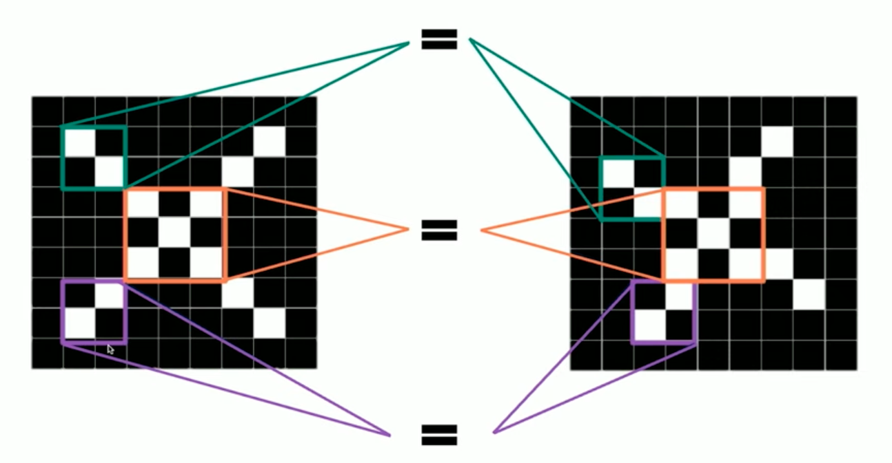
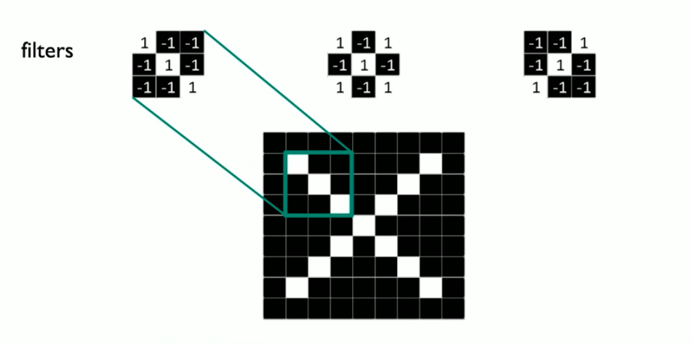
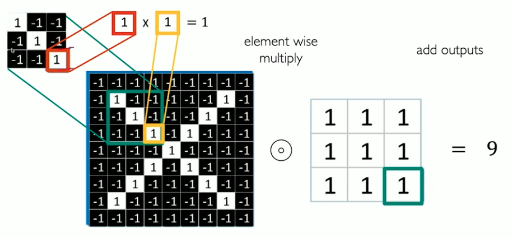
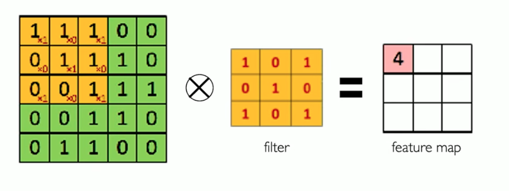
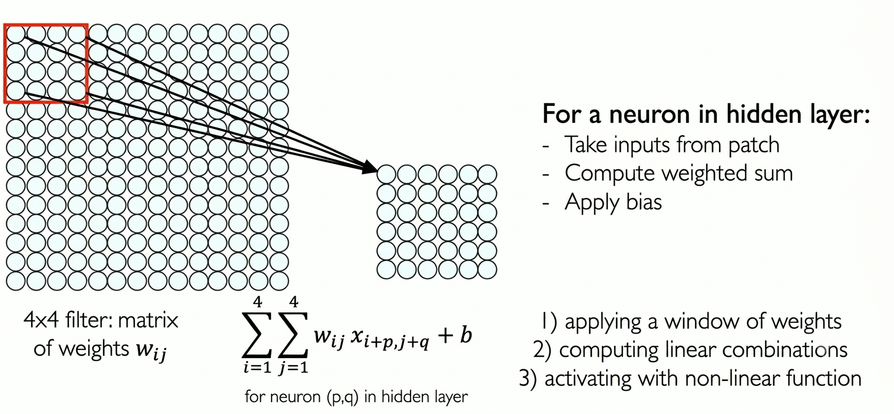
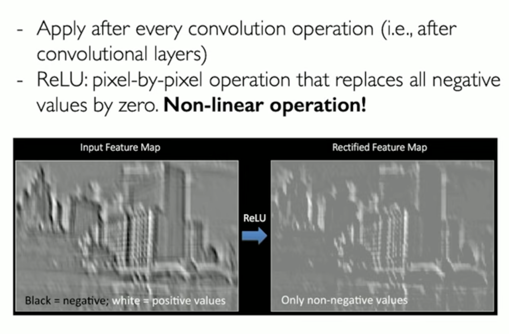
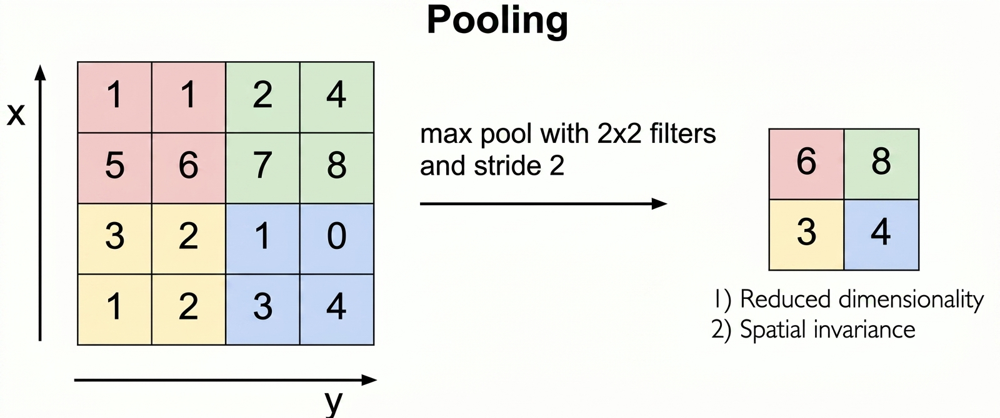
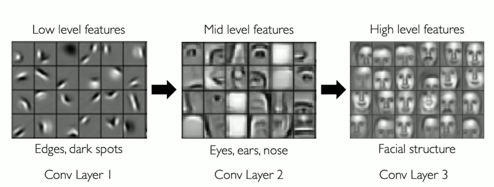
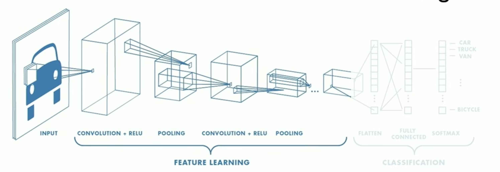

# Le Reti Neurali Convoluzionali.
In questo capitolo ci concentreremo su una parte dell'intelligenza estremamente affascinante e che molti di noi danno per scontata: **la vista**.

E' il senso che più diamo per scontato ma che ci permette di fare gran parte delle nostre attività quotidiane: riconoscere oggetti e persone.

Cos'è la vista? E' banalmente, la capacità di riconoscere qualcosa, e capire dove sta, semplicemente guardando.
Ma nella realtà è molto di più che riconoscere qualcosa, riconoscere un'immagine. Ci permette di capire le dinamiche, ad esempio le dinamiche dell'ambiente in cui siamo immersi, di capire una serie di **informazioni**.

Il deep learning si occupa di capire tutta questa quantità spropositata di informazioni, anche analizzare le immagini rientra in questa quantità spropositata di informazioni.

Questa materia nello specifico si chiama computer vision. Dove viene applicata attualmente?
Nella robotica, nel mobile computing, nella medicina, accessibilità, guida autonoma.

Il deep learning ha sempre avuto, fin dall'inizio, una moltitudine di tipi di riconoscimento e approcci diversi per la computer vision. 

Focalizzandosi principalmente sulla classificazione e il riconoscimento: come ad esempio nel caso del rilevamento e del riconoscimento facciale e del riconoscimento di patologie nel campo medico.

## Cosa vedono i computer?
Come vengono rappresentate da un computer queste informazioni che noi raccogliamo con la vista?
I computer non hanno gli occhi, non vedono i colori, vedono solo numeri.

Quindi, cosa sono le immagini per un computer? Per un computer le immagini sono "solo" numeri. Sono matrici, matrici 2D nel caso di una foto in bianco e nero ad esempio. Ogni valore della matrice corrisponde alla luminosità della cella associata.
Questa però è una rappresentazione molto semplificata, ma comunque molto potente.

Se noi vogliamo coprire lo spazio dei colori, dobbiamo estendere lo spazio a 3 matrici 2D. Abbiamo tre colori primari: RGB (rosso, verde, blue), e ognuno di questi colori è rappresentato da una matrice 2D.

Quindi essenzialmente, le immagini in bianco e nero sono rappresentate da una singola matrice, quelle a colori da una matrice tridimensionale.

Abbiamo due tipi di algoritmi per quanto riguarda la computer vision:
- regressione: gli output sono valori continui; 
- classificazione: gli output sono un vettore di probabilità.

Un esempio di problema di classificazione: data un'immagine, capire se si tratta di una persona, di un paesaggio, di un oggetto etc, non facciamo altro che assegnare una probabilità alle diverse opzioni (numero fissato di opzioni).

Può un algoritmo di machine learning differenziare tra queste 3 classi di opzioni ad esempio? Come fa?
Per farlo, per identificare queste immagini, la nostra pipeline deve essere capace di capire cosa è unico, cosa differenzia ognuna delle nostre opzioni dalle altre.

Ma come facciamo ad individuare cosa è rilevante in un'immagine? Dobbiamo individuare prima le caratteristiche che sono rilevanti, quali sono queste caratteristiche che differenziano una nostra categoria dalle altre. 

Ad esempio, prendiamo 3 casistiche:
- caso di una persona: naso, occhi, bocca;
- caso di una macchina: ruote, luci, specchi, targa;
- caso di un'abitazione: porte, finestre, scale.

Quindi noi andiamo a individuare queste caratteristiche di basso livello, e poi le mettiamo insieme per poi classificare i gruppi ad alto livello.

Quindi come abbiamo detto, un modo per risolvere questo problema, è sfruttare le conoscenze di un particolare campo, ad esempio come abbiamo detto, estrarre le caratteristiche di basso livello e poi metterle insieme per riconoscere ad esempio l'oggetto ad alto livello.

Ma c'è un problema con questo approccio: gli umani danno troppe cose per scontato, è difficile per noi definire in maniera precisa le cose, ci sono molte variazioni: anche definire una casa è difficile: variano le dimensioni, la luce, etc.

Il problema a questo punto diventa: come facciamo a riconoscere queste caratteristiche di basso livello (quelle essenziali, quelle base) di una particolare categoria?

Quindi vogliamo un modo per estrarre queste caratteristiche base, e contemporaneamente capire quando una di queste estratte è una buona caratteristica.

Per risolvere questo problema possiamo usare un approccio basato su reti neurali: impariamo direttamente dai dati, dalla profondità della nostra rete e dei dati.

## Apprendimento delle caratteristiche visive
Le reti neurali ci consentono di imparare caratteristiche visive: dai dati di queste immagini capiamo quali sono i pattern principali di queste immagini.

Utilizzeremo le FCNN (Reti Neurali completamente connesse)

Il nostro input della rete è ad una dimensione, è un'immagine 2D, dobbiamo "schiacciare" il nostro input, la nostra immagine, in modo tale da farla diventare un vettore di pixel, l'input per la nostra rete.
Con questo approccio però, stiamo "distruggendo" molto di quelle che possono essere le capacità del modello, "schiacciare" non sembra una buona idea.
Un'immagine 100x100, sarebbe un vettore di 10000 elementi, troppo poco efficiente, non è fattibile con una FCNN.

Tra l'altro, noi vogliamo utilizzare le informazioni della struttura dell'immagine, che in questo modo verrebbero perse completamente, ma come possiamo fare?

## Utilizzo della struttura spaziale
Non schicceremo la nostra immagine in una dimensione, utilizzeremo la matrice, così rappresenta adeguatamente la nostra immagine 2D.
Come utilizziamo quindi la struttura spaziale della nostra immagine?
Non connettendo ogni pixel della nostra immagine ad ogni neurone della rete, ma connettere una porzione dell'immagine ad un neurone della nostra rete, una sorta di "quadrato" (in gergo si chiama **filtro**).

Questo approccio rispecchia il modo in cui funziona la corteccia visiva umana: i nostri occhi e il nostro cervello non analizzano un'immagine tutta insieme istantaneamente, ma si concentrano su piccole aree locali per riconoscere bordi, contrasti e forme semplici.

In questo modo, abbiamo le informazioni spaziali, e inoltre stiamo risparmiando molto in termini di efficienza, perché non stiamo forzando la nostra rete a "guardare" tutto, stiamo guardando delle piccole porzioni.

Quindi il neurone a cui connettiamo questa porzione, è influenzato solo dalla porzione a cui è connesso, e da nient'altro più.

Quindi, per dare alla nostra rete il contesto dell'intera immagine, come facciamo? Non dobbiamo guardare ad una sola porzione. Andiamo a traslare questa porzione della nostra immagine, in maniera tale da connettere tutta l'immagine alla rete, ogni porzione traslata sarà connessa ad un neurone della rete.

In questo modo, stiamo guardando l'informazione spaziale della nostra immagine, e inoltre stiamo preservando l'efficienza della rete.

Quello che vogliamo fare, è cercare di imparare una caratteristica per ogni porzione della nostra immagine, vogliamo capire cosa contiene ogni porzione. Andiamo a vedere come fare.

La bellezza di questo approccio è che non dobbiamo definire noi a mano cosa cercare. Sarà la rete stessa, durante la fase di addestramento, ad imparare i valori migliori da inserire nel filtro per riconoscere le caratteristiche più rilevanti per il nostro compito.

Mentre prima gli ingegneri dovevano programmare a mano algoritmi di visione artificiale, in modo tale da descrivere matematicamente ad esempio cosa è un cerchio, ora questo compito viene "delegato" completamente alla nostra rete.

## Estrazione di caratteristiche con la convoluzione.
Questo processo di scorrimento delle porzioni (patch) della nostra immagine, è chiamato **convoluzione**.

Immaginiamo di avere una matrice 10x10. Immaginiamo inizialmente questo processo più ad alto livello, quindi con il nostro filtro di dimensione 4x4. 

Le porzioni (o patch) sono i ritagli dell'immagine che vengono analizzati uno alla volta durante la scansione. I filtri invece sono le matrici di pesi appresi dalla rete: sono loro che vengono applicati ad ogni porzione per estrarne una caratteristica.

Questo filtro 4x4 è quindi definito da 16 numeri.
Ogni porzione 4x4 dell'immagine viene processata sequenzialmente: il filtro 'legge' quei 16 pixel, esegue delle operazioni, ne estrae una sintesi numerica e poi passa alla porzione successiva. È come se il filtro facesse una scansione dell'immagine, estraendo le informazioni rilevanti da ogni piccolo tassello. 
Applicheremo a questo punto un bias, sommato al risultato della moltiplicazione, e successivamente una funzione di attivazione (non lineare, come la ReLU): questo avviene per ogni posizione in cui il filtro si sposta, producendo così la feature map di output.

Come dicevamo precedentemente, invece di schiacciare l'input e processarlo, ci concentreremo su filtri, più piccoli, applicando la stessa sequenza di operazioni: prodotto elemento per elemento tra il filtro e la porzione di immagine, somma dei risultati, aggiunta del bias e applicazione di una funzione di attivazione non lineare.

### Caso di studio

Immaginiamo di voler classificare, quindi riconoscere, se un'immagine è una X oppure no.

Per semplicità consideriamo immagini bianco o nero: i pixel neri avranno come valore -1, quelli bianchi avranno 1.

Quello che possiamo notare subito, è che per classificare, non possiamo sicuramente utilizzare l'uguaglianza, perché guardando le matrici, sono entrambe X ma non sono perfettamente uguali.

Dobbiamo quindi farlo utilizzando un approccio basato sulle caratteristiche.
Ci concentreremo quindi sulle porzioni.

Anche se queste immagini sono differenti pixel per pixel, andandole ad osservarle meglio, condividono lo stesso pattern, hanno le stesse caratteristiche.

Ogni filtro è una matrice di pesi delle stesse dimensioni di una porzione dell'immagine: viene sovrapposto ad essa per rilevare una specifica caratteristica, come una diagonale o una croce. Andiamo a definire i nostri filtri, necessari per capire se la nostra immagine è una x:

I nostri filtri sono 3: diagonale 1, una croce, e la diagonale 2.

A questo punto, quello che dobbiamo definire, è l'operazione che utlizzeremo per mettere tutto questo insieme. I filtri (i pesi che scegliamo) e le porzioni che scorriamo nella matrice, per estrarre queste caratteristiche.

L'operazione è chiamata convoluzione, che non è altro che una moltiplicazione elemento per elemento della porzione per il filtro.

Nel nostro caso, da questa moltiplicazione, otteniamo 9 come risultato, significa che c'è un match perfetto tra la nostra porzione e il nostro filtro.

Numero molto positivo: buon matching;
Numero molto negativo: pessimo match.

Immaginiamo di voler applicare la convoluzone di una matrice 5x5 con un filtro 3x3, otterremo in output una matrice 3x3 (con stride = 1):

praticamente per ogni porzione 3x3 definibile della nostra matrice, avremo un risultato nella feature map (il risultato delle operazioni di convoluzione).

La feature map ci dice dove è la caratteristica che stiamo cercando all'interno dell'immagine.

Importante da ricordare: i pesi dei nostri filtri, sono imparati dalla nostra rete, non li definiamo noi. Negli esempi che stiamo vedendo, li abbiamo definiti noi per semplificare l'apprendimento e la visualizzazione della convoluzione.

Perché quando trasliamo la porzione, andiamo a ricoprire parte della porzione che era già stata coperta? Non è obbligatorio, ci sono dei tipi di neural networks che non lo fanno, ma il motivo è: se il filtro saltasse sempre a una posizione completamente nuova (senza sovrapposizione), rischierebbe di non vedere mai una caratteristica che si trova esattamente nel mezzo tra due salti. Traslando di un solo pixel alla volta, ci assicuriamo di non perdere nulla.

Questo parametro si chiama stride (passo): definisce di quanti pixel trasliamo il filtro ad ogni passo.

Stride = 1: massima sovrapposizione, nessuna informazione persa, feature map più grande.
Stride = 2 (o più): meno sovrapposizione, più veloce, ma si rischia di perdere dettagli, feature map più piccola.

Quindi la sovrapposizione non è un difetto, è una scelta progettuale: garantisce che il filtro abbia la possibilità di "vedere" ogni caratteristica dell'immagine, indipendentemente da dove si trova.

Immaginiamo anora di creare noi i filtri, con i relativi pesi, e vediamo come filtri diversi possono produrre caratteristiche diverse, feature map diverse:

Andiamo a vedere i risultati della convoluzione di questa immagine, applicando filtri diversi:
- il primo filtro serve ad analizzare la nitidezza dell'immagine;
- il secondo a rilevare i bordi;
- il terzo a identificare fortemente i bordi.

Quindi prima dell'esistenza delle reti neurali, gli umani dovevano scrivere a mano questi filtri, per riconoscere, classificare, individuare bordi, colori...

Ora li impariamo, non li scriviamo più a mano. 

Prima di vedere le Convolutional Neural Networks, facciamo un breve recap, abbiamo fatto 3 step:
- applichiamo una matrice di pesi (un filtro) per estrarre caratteristiche locali;
- utilizziamo più filtri per estrarre diverse caratteristiche;
- lo stesso filtro, con i suoi pesi condivisi, viene utilizzato su tutta l'immagine durante la scansione: per ogni filtro otteniamo una feature map.

## Convolutional Neural Networks (CNNs)
Andiamo a vedere come è fatta una CNN nel caso di classificazione di immagini:

Il nostro obiettivo è di imparare le caratteristiche direttamente dalle nostre immagini, e vogliamo usare queste caratteristiche estratte, per effettuare delle classificazioni, in sintesi, estraiamo come deve essere un cavallo ad esempio, e poi usiamo queste caratteristiche estratte per rispondere a un problema di classificazione che ci chiede se l'immagine che diamo in input è un cavallo o no.

In una CNN le tre operazioni principali sono 3:
- convoluzione: applichiamo i filtri per generare le feature maps;
- non linearità: dobbiamo applicare la funzione non lineare (spesso la ReLU);
- pooling: sottocampionamento, riduciamo la dimensione delle feature map mantenendo solo le informazioni più salienti. Questo serve a ridurre il costo computazionale, rendere la rete più robusta a piccole variazioni nella posizione delle caratteristiche nell'immagine, e favorire la generalizzazione verso feature di alto livello.

Il nostro obiettivo è quindi, allenare il nostro modello su un set di immagini, ovvero alleniamo questi filtri, questa estrazione delle caratteristiche, questi pesi (numeri), attraverso ogni livello dei nostri layer nella rete. 

Per ogni neurone nell'hidden layer quindi, ci prendiamo gli input dalle porzioni (come dicevamo per ogni porzione un input), calcoliamo la somma pesata, applichiamo il bias.

Il filtro è una piccola matrice di pesi, ad esempio 3x3. È lo strumento che la rete usa per cercare una caratteristica specifica nell'immagine, come un bordo verticale, una curva, o una macchia di colore.
La feature map è il risultato di quel filtro applicato all'intera immagine: è una mappa che dice "in questa posizione ho trovato quella caratteristica, in quest'altra no". Un filtro produce sempre una feature map.
La caratteristica è ciò che il filtro impara a riconoscere: bordi, angoli, texture, forme. Nei layer iniziali sono caratteristiche semplici, nei layer più profondi diventano complesse.
Il layer è un livello della rete, e contiene più filtri in parallelo. Ogni filtro del layer cerca una caratteristica diversa, e produce la propria feature map. Il risultato del layer è quindi un volume 3D: tante feature map quanti sono i filtri.
Il receptive field (campo recettivo) è la porzione dell'immagine originale che ha influenzato un determinato neurone.

Esempio concreto. Immagina di voler riconoscere un gatto.

- il layer 1 ha 32 filtri. Ognuno cerca qualcosa di semplice: bordi orizzontali, bordi verticali, contrasti di colore. Il risultato è un volume con 32 feature map.
- il layer 2 ha 64 filtri. Ora lavora sul volume prodotto dal layer 1, quindi combina i bordi trovati prima per cercare forme più complesse: curve, angoli, macchie. Produce 64 feature map.
- il layer 3 ha 128 filtri. Combina le forme per cercare strutture ancora più astratte: un occhio, un'orecchio, il pelo.

Man mano che si va in profondità, le caratteristiche diventano combinazioni delle precedenti. Dal layer 1 con 32 tipi di bordi, il layer 2 deve cercare tutte le possibili combinazioni di quei bordi per formare forme. Il numero di combinazioni cresce molto rapidamente, quindi servono più filtri per coprirle tutte in modo adeguato.

Ogni pezzo del nostro output volume è influenzato da un piccolo pezzo di porzione iniziale dell'input.

Una volta ottenuto questo volume, il prossimo step è quello di applicare la funzione di non linearità. Perché lo facciamo? Perché come abbiamo già detto nei capitoli precedenti, i dati sono estremamente non lineari. Nelle CNN è una pratica abbastanza diffusa, applicare le funzioni non lineare dopo ogni convoluzione.
Come abbiamo già detto la più comune è la ReLU.
Prende ogni valore negativo e lo fa diventare zero, e prende ogni valore positivo e lo fa restare tale, si comporta come identità nel caso di valori positivi.

$$ g(z) = max(0, z) $$

### Pooling
Entriamo nel dettaglio di come funziona il Pooling. Come abbiamo detto, serve a diminuire la dimensione della nostra feature map, rendendo il calcolo più efficiente e preservando le informazioni spaziali più importanti.

Non facciamo altro che usare una scala diversa per l'analisi: riduciamo la risoluzione dell'immagine per "zoomare" fuori. Scalando verso il piccolo la nostra matrice, stiamo paradossalmente aumentando la dimensione relativa del campo visivo della rete.

Per capire meglio questo concetto, pensa al Pooling come a una lente che ci permette di allargare lo sguardo:

Dimensione relativa: Quando riduciamo la matrice, ogni singolo valore risultante "rappresenta" una porzione dell'immagine originale più ampia rispetto a prima.

Invece di analizzare sempre i micro-dettagli, i neuroni negli strati successivi iniziano a vedere strutture più complesse. Riducendo la scala spaziale, la rete smette di concentrarsi sul "dove" esatto si trovi un pixel e inizia a capire "cosa" è presente in quell'area, passando dai semplici bordi a parti di oggetti più grandi.

In sintesi, il Pooling non sta solo rimpicciolendo i dati, sta aiutando la rete a sintetizzare le informazioni, permettendole di passare dall'analisi di dettagli locali a quella di concetti globali.

Il modo più comune è quello del max pooling, ovvero prendere il valore più grande della sotto porzione.

Se usiamo finestre di Pooling troppo grandi (es. 4x4 o 6x6):
- Vantaggio: Riduciamo drasticamente le dimensioni della matrice, rendendo la rete estremamente veloce e leggera.
- Svantaggio: Perdiamo troppa informazione spaziale. È come tentare di descrivere un'immagine guardandola attraverso un mosaico di tessere giganti: perdiamo i dettagli che servono a distinguere forme simili.

Se usiamo finestre di Pooling troppo piccole (es. 1x1 o 2x2):
- Vantaggio: Preserviamo molta più precisione e dettaglio nell'immagine.
- Svantaggio: La rete rimpicciolisce troppo lentamente. Questo costringe a mantenere matrici più grandi per molti più strati, rendendo la rete lenta e aumentando il rischio di overfitting (la rete impara "a memoria" i dettagli anziché generalizzare il concetto).

Vediamo un esempio di CNN:

## CNN per classificare
Una CNN per la classificazione si può idealmente dividere in due blocchi funzionali distinti, che lavorano in sequenza: 

- **feature extractor**: questa è la parte convoluzionale della rete. È composta da una successione di blocchi [Convoluzione $\rightarrow$ ReLU $\rightarrow$ Pooling].
La profondità di questa sezione (quanti strati impiliamo) dipende dalla complessità del compito. Più la rete è profonda, più le caratteristiche estratte diventano astratte: si passa da semplici bordi (strati iniziali) a forme complesse e parti di oggetti (strati finali). Questa parte della rete non "classifica" ancora, ma "comprende" cosa c'è nell'immagine.

- **classificazione**: una volta che abbiamo estratto le mappe delle caratteristiche di alto livello, dobbiamo prendere una decisione. Qui avviene il passaggio dai dati spaziali (matrici) a quelli lineari:

    - **Flattening**: prendiamo i risultati finali della convoluzione e li "appiattiamo" (trasformiamo la matrice in un vettore unidimensionale).

    - **Fully Connected Layer**: Questo vettore viene dato in pasto a una serie di strati completamente connessi (FCNN). A questo punto, la rete non cerca più "bordi" o "forme", ma combina le caratteristiche estratte per pesare le probabilità delle classi finali.

    - **Softmax**: è lo strato finale. Applica la funzione Softmax per trasformare i punteggi grezzi in probabilità che sommano a 1. 
    Ad esempio: "80% Cane, 15% Gatto, 5% Auto".
    Un punto chiave da ricordare è che, durante l'addestramento, tutta la rete viene aggiornata. Quando la rete sbaglia la classificazione finale, l'errore viene riportato indietro (Backpropagation) non solo al classificatore, ma anche ai filtri convoluzionali. Questo significa che la rete sta continuamente perfezionando il suo modo di "vedere" (i filtri) per migliorare la sua capacità di "decidere" (il classificatore).

Ci siamo focalizzati principalmente sulla classificazione, ma in realtà la convoluzione viene applicata per la risuluzione di diversi task, ha diverse applicazioni. E' un tipo di architettura utilizzata spesso.

## Un'architettura con diverse applicazioni
La grande forza delle CNN risiede nella modularità della loro architettura. Possiamo dividere la rete in due blocchi funzionali: il **Feature Learning** (la parte convoluzionale che estrae le caratteristiche) e il **Classifier** (la parte finale che prende la decisione).

Questa separazione è estremamente potente: possiamo mantenere invariato il Feature Extractor, che ha imparato a "vedere" e comprendere il mondo visivo, e modificare semplicemente la "testa" (il Classifier) per adattarla a diversi compiti.

Ecco le applicazioni principali:

### 1. Classificazione
**Cos'è**: il compito più elementare. La rete analizza l'intera immagine e assegna una singola etichetta (o una distribuzione di probabilità) all'oggetto principale.

**Esempio**: un sistema che analizza una foto e determina se contiene un cane, un gatto o un'auto.

### 2. Object Detection (Rilevamento)
**Cos'è**: la rete non si limita a identificare l'oggetto, ma ne localizza la posizione esatta disegnando un rettangolo (bounding box) attorno ad esso. Per ogni oggetto rilevato, l'output contiene la **classe** (taxi, persona, ecc.) e le **coordinate** del rettangolo (x, y, larghezza, altezza).

**Il problema dell'output variabile**: a differenza della classificazione, dove l'output è sempre di dimensione fissa, qui il numero di oggetti nell'immagine non è noto in anticipo. Un'immagine può contenere un solo taxi, un'altra può contenere un taxi e tre persone. L'output quindi cambia dimensione a seconda di quanti oggetti vengono rilevati.

**Esempio**: i sistemi di guida autonoma che devono individuare in tempo reale pedoni, segnali stradali e altri veicoli per pianificare la traiettoria.

Un primo approccio naive consisteva nel campionare una grande quantità di box casuali sull'immagine e applicare la CNN su ognuno di essi per verificare se contenesse un oggetto, ma è estremamente inefficiente.

Un approccio più intelligente è quello delle **region proposals**: invece di box casuali, si analizza l'immagine con metodi euristici (come il selective search) per identificare le zone che con più probabilità contengono oggetti, basandosi su variazioni di colore, texture e intensità. La CNN viene poi applicata solo su queste regioni candidate. Questo è il principio alla base di architetture come **R-CNN**.

Questo è meglio del primo, ma è comunque lento, perché aspettiamo un altro modello, euristico (basato sulla nostra conoscenza), quindi non di machine learning, potremmo avere molte box che non sono rilevanti, non stiamo imparando dove sono le box, non va bene insomma.

Arriviamo ad una soluzione ampiamente utilizzata nella pratica: diamo l'intera immagine in input ai layer convoluzionali, che estraggono le feature map. Queste feature map vengono poi usate sia per classificare gli oggetti che per predire direttamente le coordinate dei bounding box, tutto in un unico passaggio. La rete impara da sola dove guardare, senza bisogno di un modello esterno che proponga le regioni. Questo è il principio alla base di architetture come **YOLO** (You Only Look Once).

In sintesi: la rete estrae le feature dall'intera immagine in un solo passaggio, propone i bounding box e li classifica simultaneamente, rendendo il processo molto più veloce ed efficiente rispetto agli approcci precedenti. La classificazione avviene confrontando le feature della zona del bounding box con i pattern appresi durante il training. Le classi non vengono decise dalla rete: vengono fornite durante il training attraverso dataset annotati a mano da esseri umani, dove per ogni immagine sono state specificate le coordinate dei bounding box e l'etichetta di ogni oggetto. Se il dataset contiene solo "taxi" e "persona", la rete imparerà a riconoscere solo quelle due classi.

Inoltre, se le box proposte sono sbagliate, con la backpropagation riusciamo a ottimizzare il rilevamento delle box.

### 3. Segmentazione
**Cos'è**: il livello di analisi più granulare. La rete classifica ogni singolo pixel dell'immagine, definendo il contorno preciso di ogni oggetto presente.

Ad esempio, diamo in input un'immagine, e vogliamo in output un'altra immagine che mi chiarisce i contorni dell'immagine di input. Per ogni pixel, vogliamo sapere a quale classe appartiene questo pixel. Questo è un altro caso di classificazione, ma in questo caso la classificazione non è un semplice output, ma un'immagine.

**Esempio**: in campo medico, per isolare con precisione chirurgica l'area di un tumore in una risonanza magnetica, distinguendo il tessuto malato da quello sano.

### 4. Controllo Probabilistico (Regressione)
**Cos'è**: qui non classifichiamo, ma prediciamo valori numerici continui che servono per regolare un comportamento o uno stato fisico.

**Esempio**: nella guida autonoma, la rete riceve in input le immagini della telecamera e una mappa (anch'essa rappresentata come immagine). Queste vengono elaborate da layer convoluzionali separati, e il risultato viene combinato per predire direttamente i comandi di guida: quanto sterzare, accelerare o frenare. L'intero sistema può essere addestrato end-to-end come un'unica CNN molto grande.

### Tabella riassuntiva

| Task | Output finale | Domanda a cui risponde |
|---|---|---|
| Classificazione | Probabilità per classe | "Che cos'è?" |
| Object Detection | Classe + coordinate rettangolo | "Dove si trova?" |
| Segmentazione | Etichetta per ogni pixel | "Qual è la forma esatta?" |
| Controllo | Valore numerico (es. forza) | "Come devo agire?" |

Questa modularità permette di applicare tecniche come il **Transfer Learning**, dove prendiamo una rete pre addestrata su milioni di immagini e la adattiamo in pochi minuti al nostro compito specifico, semplicemente sostituendo l'ultimo strato.
