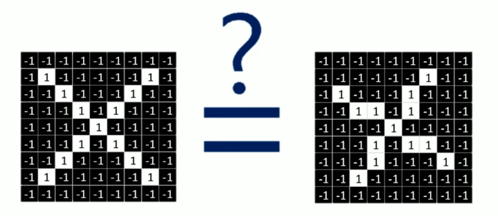
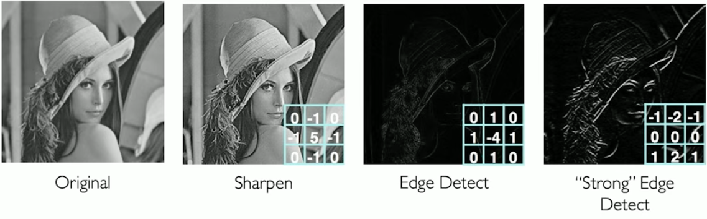
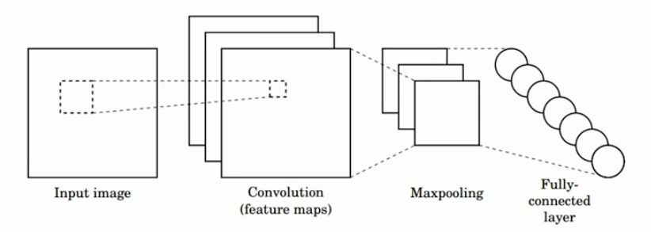
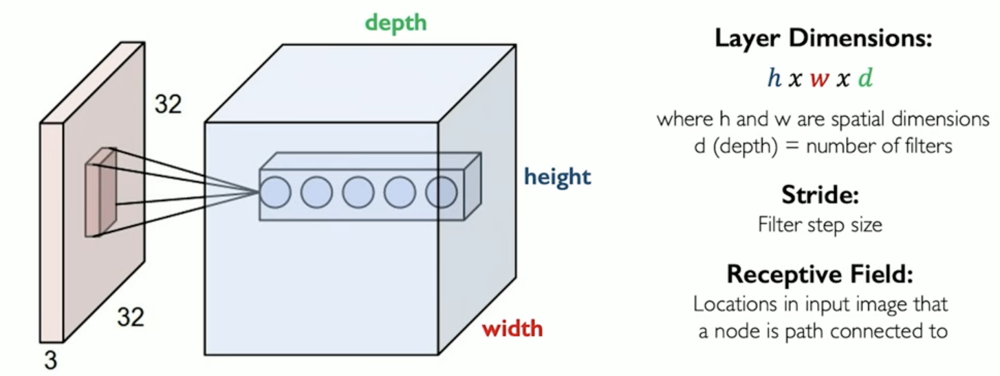
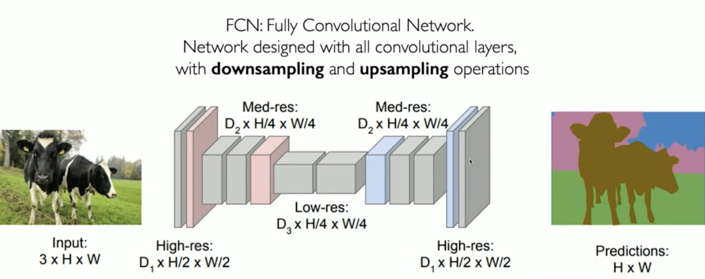

# Convolutional Neural Networks
In this chapter we will focus on a fascinating part of intelligence that many of us take for granted: **sight**.

It is the sense we take most for granted, yet it allows us to carry out most of our daily activities: recognizing objects and people.

What is sight? Simply put, it is the ability to recognize something, and understand where it is, just by looking.
But in reality it is much more than recognizing something, recognizing an image. It allows us to understand dynamics, for example the dynamics of the environment we are immersed in, to understand a series of **information**.

Deep learning deals with understanding this enormous quantity of information, and analyzing images is part of this enormous quantity of information.

This specific field is called computer vision. Where is it currently applied?
In robotics, mobile computing, medicine, accessibility, autonomous driving.

Deep learning has always had, from the very beginning, a multitude of recognition types and different approaches to computer vision.

Focusing mainly on classification and recognition: as in the case of face detection and recognition, and the recognition of pathologies in the medical field.

## What do computers see?
How is the information we collect with our sight represented by a computer?
Computers do not have eyes, they do not see colors, they only see numbers.

So, what are images to a computer? For a computer, images are "just" numbers. They are matrices, 2D matrices in the case of a black and white photo for example. Each value of the matrix corresponds to the brightness of the associated cell.
This is a very simplified representation, but still very powerful.

If we want to cover the color space, we need to extend the space to 3 2D matrices. We have three primary colors: RGB (red, green, blue), and each of these colors is represented by a 2D matrix.

So essentially, black and white images are represented by a single matrix, while color images are represented by a three-dimensional matrix.

We have two types of algorithms for computer vision:
- regression: outputs are continuous values;
- classification: outputs are a probability vector.

An example of a classification problem: given an image, determine whether it contains a person, a landscape, an object, etc. We simply assign a probability to each option (fixed number of options).

Can a machine learning algorithm differentiate between these 3 classes of options for example? How does it do it?
To do so, to identify these images, our pipeline must be able to understand what is unique, what differentiates each of our options from the others.

But how do we identify what is relevant in an image? We must first identify the relevant features, which are the features that differentiate one category from the others.

For example, let us take 3 cases:
- case of a person: nose, eyes, mouth;
- case of a car: wheels, lights, mirrors, license plate;
- case of a house: doors, windows, stairs.

So we identify these low-level features, and then combine them to classify the high-level groups.

As we said, one way to solve this problem is to leverage domain knowledge: extract low-level features and then combine them to recognize the high-level object.

But there is a problem with this approach: humans take too many things for granted, it is difficult for us to define things precisely, there are many variations. Even defining a house is difficult: dimensions, light, etc. all vary.

The problem at this point becomes: how do we recognize these low-level features (the essential ones, the basic ones) of a particular category?

So we want a way to extract these basic features, while simultaneously understanding when one of those extracted is a good feature.

To solve this problem we can use a neural network-based approach: we learn directly from the data, from the depth of our network and of the data.

## Learning visual features
Neural networks allow us to learn visual features: from the data of these images we understand what the main patterns of these images are.

We will use FCNNs (Fully Connected Neural Networks).

Our network input is one-dimensional, it is a 2D image, we need to "flatten" our input, our image, so that it becomes a vector of pixels, the input for our network.
With this approach however, we are "destroying" much of what could be the model's capabilities. "Flattening" does not seem like a good idea.
A 100x100 image would become a vector of 10000 elements, far too inefficient, it is not feasible with a FCNN alone.

Furthermore, we want to use the information of the image's structure, which would be completely lost in this way. So how can we do it?

## Using spatial structure
We will not flatten our image into one dimension, we will use the matrix, which adequately represents our 2D image.
How do we then use the spatial structure of our image?
Not by connecting every pixel of our image to every neuron of the network, but by connecting a portion of the image to a neuron of our network, a sort of "square" (in technical terms this is called a **filter**).

This approach mirrors the way the human visual cortex works: our eyes and brain do not analyze an image all at once instantaneously, but focus on small local areas to recognize edges, contrasts, and simple shapes.

In this way, we have spatial information, and we are also saving a lot in terms of efficiency, because we are not forcing our network to "look" at everything, we are looking at small portions.

So the neuron we connect this portion to is influenced only by the portion it is connected to, and nothing else.

So, how do we give our network the context of the entire image? We must not look at just one portion. We slide this portion of our image, so as to connect the entire image to the network, with every slid portion connected to a neuron of the network.

In this way, we are looking at the spatial information of our image, while also preserving the efficiency of the network.

What we want to do is learn one feature for each portion of our image, we want to understand what each portion contains. Let us see how to do that.

The beauty of this approach is that we do not need to manually define what to look for. The network itself, during the training phase, will learn the best values to place in the filter to recognize the most relevant features for our task.

While engineers previously had to manually program computer vision algorithms, mathematically describing for example what a circle is, this task is now "delegated" entirely to our network.

## Feature extraction with convolution.
This process of sliding portions (patches) of our image is called **convolution**.

Imagine having a 10x10 matrix. Let us initially think about this process at a higher level, with our filter of size 4x4.

The portions (or patches) are the crops of the image that are analyzed one at a time during the scan. The filters are the matrices of weights learned by the network: they are applied to each portion to extract a feature from it.

This 4x4 filter is therefore defined by 16 numbers.
Each 4x4 portion of the image is processed sequentially: the filter "reads" those 16 pixels, performs some operations, extracts a numerical summary, and then moves on to the next portion. It is as if the filter were scanning the image, extracting relevant information from each small tile.
We will then apply a bias, added to the result of the multiplication, and then a non-linear activation function (such as ReLU): this happens for every position the filter moves to, producing the output feature map.

As we said earlier, instead of flattening the input and processing it, we will focus on smaller filters, applying the same sequence of operations: element-wise product between the filter and the image portion, sum of the results, addition of the bias, and application of a non-linear activation function.

### Case study

Imagine we want to classify, that is recognize, whether an image is an X or not.

For simplicity let us consider black and white images: black pixels will have a value of -1, white pixels will have a value of 1.

What we can immediately notice is that for classification, we certainly cannot use equality, because looking at the matrices, they are both X's but they are not perfectly identical.

We therefore need to do it using a feature-based approach.
We will focus on the portions.

Even though these images are different pixel by pixel, looking at them more carefully, they share the same pattern, they have the same features.

Each filter is a weight matrix with the same dimensions as a portion of the image: it is overlaid on it to detect a specific feature, such as a diagonal or a cross. Let us define our filters, needed to determine whether our image is an X:

Our filters are 3: diagonal 1, a cross, and diagonal 2.

At this point, what we need to define is the operation we will use to put all of this together. The filters (the weights we choose) and the portions we slide through the matrix, to extract these features.

The operation is called convolution, which is nothing more than an element-wise multiplication of the portion by the filter.

In our case, from this multiplication we get 9 as the result, meaning there is a perfect match between our portion and our filter.

Very positive number: good match;
Very negative number: poor match.

Imagine applying the convolution of a 5x5 matrix with a 3x3 filter, we will get a 3x3 matrix as output (with stride = 1):

Essentially for every definable 3x3 portion of our matrix, we will have a result in the feature map (the result of the convolution operations).

The feature map tells us where the feature we are looking for is located within the image.

Important to remember: the weights of our filters are learned by our network, we do not define them. In the examples we are looking at, we have defined them ourselves to simplify the understanding and visualization of convolution.

Why, when we slide the portion, do we cover part of the portion that was already covered? It is not mandatory, there are types of neural networks that do not do this, but the reason is: if the filter always jumped to a completely new position (without overlap), it might never see a feature that lies exactly in the middle between two jumps. By sliding one pixel at a time, we make sure we do not miss anything.

This parameter is called stride (step): it defines by how many pixels we slide the filter at each step.

Stride = 1: maximum overlap, no information lost, larger feature map.
Stride = 2 (or more): less overlap, faster, but at the risk of losing details, smaller feature map.

So overlap is not a flaw, it is a design choice: it ensures that the filter has the opportunity to "see" every feature of the image, regardless of where it is located.

Let us imagine creating our own filters, with their respective weights, and see how different filters can produce different features, different feature maps:

Let us look at the results of convolving this image with different filters:
- the first filter is used to analyze the sharpness of the image;
- the second to detect edges;
- the third to strongly identify edges.

So before neural networks existed, humans had to manually write these filters, to recognize, classify, detect edges, colors...

Now we learn them, we no longer write them by hand.

Before looking at Convolutional Neural Networks, let us do a brief recap. We went through 3 steps:
- we apply a weight matrix (a filter) to extract local features;
- we use multiple filters to extract different features;
- the same filter, with its shared weights, is used across the entire image during the scan: for each filter we get one feature map.

## Convolutional Neural Networks (CNNs)
Let us look at what a CNN looks like in the case of image classification:

Our goal is to learn features directly from our images, and we want to use these extracted features to perform classifications. In short, we extract what a horse looks like for example, and then use these extracted features to answer a classification problem asking whether the image we give as input is a horse or not.

In a CNN the three main operations are:
- convolution: we apply the filters to generate the feature maps;
- non-linearity: we must apply the non-linear function (often ReLU);
- pooling: subsampling, we reduce the size of the feature maps while keeping only the most salient information. This serves to reduce computational cost, make the network more robust to small variations in the position of features in the image, and encourage generalization toward high-level features.

Our goal is therefore to train our model on a set of images, that is, we train these filters, this feature extraction, these weights (numbers), through every level of our layers in the network.

For each neuron in the hidden layer, we take the inputs from the portions (as we said, one input per portion), calculate the weighted sum, apply the bias.

The filter is a small weight matrix, for example 3x3. It is the tool the network uses to look for a specific feature in the image, such as a vertical edge, a curve, or a patch of color.
The feature map is the result of that filter applied to the entire image: it is a map that says "at this position I found that feature, at this other one I did not". One filter always produces one feature map.
The feature is what the filter learns to recognize: edges, corners, textures, shapes. In the early layers they are simple features, in deeper layers they become complex.
The layer is a level of the network, and contains multiple filters in parallel. Each filter in the layer looks for a different feature, and produces its own feature map. The result of the layer is therefore a 3D volume: as many feature maps as there are filters.
The receptive field is the portion of the original image that has influenced a given neuron.

Concrete example. Imagine wanting to recognize a cat.

- layer 1 has 32 filters. Each one looks for something simple: horizontal edges, vertical edges, color contrasts. The result is a volume with 32 feature maps.
- layer 2 has 64 filters. It now works on the volume produced by layer 1, so it combines the edges found before to look for more complex shapes: curves, corners, patches. It produces 64 feature maps.
- layer 3 has 128 filters. It combines the shapes to look for even more abstract structures: an eye, an ear, fur.

As we go deeper, features become combinations of previous ones. Starting from layer 1 with 32 types of edges, layer 2 needs to look for all possible combinations of those edges to form shapes. The number of combinations grows very quickly, so more filters are needed to cover them all adequately.

Each piece of our output volume is influenced by a small piece of the original input portion.

Once we have obtained this volume, the next step is to apply the non-linearity function. Why do we do this? Because, as we have already said in previous chapters, data is extremely non-linear. In CNNs it is fairly common practice to apply non-linear functions after each convolution.
As we have already said, the most common is ReLU.
It takes every negative value and makes it zero, and takes every positive value and leaves it as is, behaving as the identity function in the case of positive values.

$$ g(z) = max(0, z) $$

### Pooling
Let us look in detail at how Pooling works. As we said, it serves to reduce the size of our feature map, making computation more efficient and preserving the most important spatial information.

We simply use a different scale for the analysis: we reduce the resolution of the image to "zoom out". By scaling our matrix down, we are paradoxically increasing the relative size of the network's field of view.

To better understand this concept, think of Pooling as a lens that allows us to widen our gaze:

Relative size: when we reduce the matrix, each resulting value "represents" a wider portion of the original image than before.

Instead of always analyzing micro-details, neurons in subsequent layers begin to see more complex structures. By reducing the spatial scale, the network stops focusing on the exact "where" a pixel is located and starts understanding "what" is present in that area, moving from simple edges to parts of larger objects.

In summary, Pooling is not just shrinking the data, it is helping the network synthesize information, allowing it to move from analyzing local details to understanding global concepts.

The most common method is max pooling, which means taking the largest value from the sub-portion.

If we use Pooling windows that are too large (e.g. 4x4 or 6x6):
- Advantage: We drastically reduce the size of the matrix, making the network extremely fast and lightweight.
- Disadvantage: We lose too much spatial information. It is like trying to describe an image by looking at it through a mosaic of giant tiles: we lose the details needed to distinguish similar shapes.

If we use Pooling windows that are too small (e.g. 1x1 or 2x2):
- Advantage: We preserve much more precision and detail in the image.
- Disadvantage: The network shrinks too slowly. This forces us to keep larger matrices for many more layers, making the network slow and increasing the risk of overfitting (the network memorizes the details instead of generalizing the concept).

Let us look at an example of a CNN:

## CNNs for classification
A CNN for classification can ideally be divided into two distinct functional blocks, working in sequence:

- **feature extractor**: this is the convolutional part of the network. It is composed of a succession of blocks [Convolution $\rightarrow$ ReLU $\rightarrow$ Pooling].
The depth of this section (how many layers we stack) depends on the complexity of the task. The deeper the network, the more abstract the extracted features become: it goes from simple edges (early layers) to complex shapes and parts of objects (final layers). This part of the network does not "classify" yet, it "understands" what is in the image.

- **classification**: once we have extracted the high-level feature maps, we need to make a decision. Here is where the transition from spatial data (matrices) to linear data happens:

    - **Flattening**: we take the final results of the convolution and "flatten" them (transform the matrix into a one-dimensional vector).

    - **Fully Connected Layer**: this vector is fed into a series of fully connected layers (FCNN). At this point, the network is no longer looking for "edges" or "shapes", but is combining the extracted features to weigh the probabilities of the final classes.

    - **Softmax**: this is the final layer. It applies the Softmax function to transform raw scores into probabilities that sum to 1.
    For example: "80% Dog, 15% Cat, 5% Car".
    A key point to remember is that during training, the entire network is updated. When the network makes a wrong final classification, the error is propagated back (Backpropagation) not only to the classifier, but also to the convolutional filters. This means the network is continuously refining its way of "seeing" (the filters) to improve its ability to "decide" (the classifier).

We have focused mainly on classification, but in reality convolution is applied to solve several different tasks, it has many applications. It is a widely used type of architecture.

## An architecture with diverse applications
The great strength of CNNs lies in the modularity of their architecture. We can divide the network into two functional blocks: **Feature Learning** (the convolutional part that extracts features) and the **Classifier** (the final part that makes the decision).

This separation is extremely powerful: we can keep the Feature Extractor unchanged, which has learned to "see" and understand the visual world, and simply modify the "head" (the Classifier) to adapt it to different tasks.

Here are the main applications:

### 1. Classification
**What it is**: the most basic task. The network analyzes the entire image and assigns a single label (or a probability distribution) to the main object.

**Example**: a system that analyzes a photo and determines whether it contains a dog, a cat, or a car.

### 2. Object Detection
**What it is**: the network does not just identify the object, it also locates its exact position by drawing a rectangle (bounding box) around it. For each detected object, the output contains the **class** (taxi, person, etc.) and the **coordinates** of the rectangle (x, y, width, height).

**The variable output problem**: unlike classification, where the output is always a fixed size, here the number of objects in the image is not known in advance. An image may contain a single taxi, another may contain a taxi and three people. The output therefore changes size depending on how many objects are detected.

**Example**: autonomous driving systems that must identify pedestrians, road signs, and other vehicles in real time to plan the trajectory.

A first naive approach consisted of sampling a large number of random boxes on the image and applying the CNN to each one to check whether it contained an object, but this is extremely inefficient.

A smarter approach is that of **region proposals**: instead of random boxes, the image is analyzed with heuristic methods (such as selective search) to identify the areas most likely to contain objects, based on variations in color, texture, and intensity. The CNN is then applied only to these candidate regions. This is the principle behind architectures like **R-CNN**.

This is better than the first approach, but it is still slow, because we are waiting on another model, a heuristic one (based on our knowledge), so not machine learning, we may have many boxes that are not relevant, we are not learning where the boxes are. Not ideal.

We arrive at a widely used solution in practice: we feed the entire image to the convolutional layers, which extract the feature maps. These feature maps are then used both to classify objects and to directly predict the coordinates of the bounding boxes, all in a single pass. The network learns on its own where to look, without needing an external model to propose regions. This is the principle behind architectures like **YOLO** (You Only Look Once).

In summary: the network extracts features from the entire image in a single pass, proposes bounding boxes and classifies them simultaneously, making the process much faster and more efficient compared to previous approaches. Classification happens by comparing the features of the bounding box area with the patterns learned during training. The classes are not decided by the network: they are provided during training through datasets annotated by hand by humans, where for each image the coordinates of the bounding boxes and the label of each object have been specified. If the dataset contains only "taxi" and "person", the network will learn to recognize only those two classes.

Furthermore, if the proposed boxes are wrong, we can optimize bounding box detection through backpropagation.

### 3. Segmentation
**What it is**: the most granular level of analysis. The network classifies every single pixel of the image, defining the precise contour of each object present.

For example, we give an image as input, and we want as output another image that clarifies the contours of the input image. For each pixel, we want to know which class that pixel belongs to. This is another case of classification, but here the classification is not a simple output, it is an image.

**Example**: in the medical field, to surgically isolate the area of a tumor in an MRI scan, distinguishing diseased tissue from healthy tissue.

### 4. Probabilistic Control (Regression)
**What it is**: here we do not classify, we predict continuous numerical values used to regulate a behavior or physical state.

**Example**: in autonomous driving, the network receives as input the camera images and a map (also represented as an image). These are processed by separate convolutional layers, and the result is combined to directly predict driving commands: how much to steer, accelerate, or brake. The entire system can be trained end-to-end as a single large CNN.

### Summary table

| Task | Final output | Question it answers |
|---|---|---|
| Classification | Probability per class | "What is it?" |
| Object Detection | Class + rectangle coordinates | "Where is it?" |
| Segmentation | Label for each pixel | "What is its exact shape?" |
| Control | Numerical value (e.g. force) | "How should I act?" |

This modularity allows applying techniques such as **Transfer Learning**, where we take a network pre-trained on millions of images and adapt it to our specific task in a few minutes, simply by replacing the last layer.