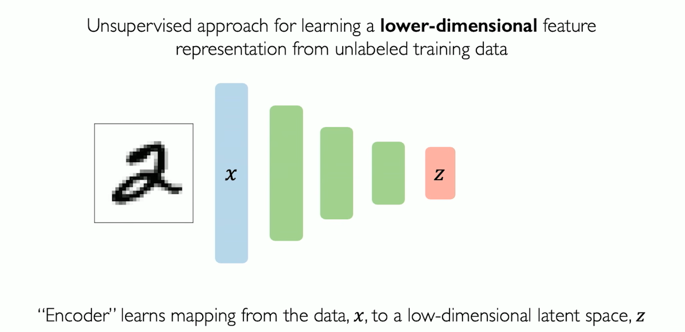
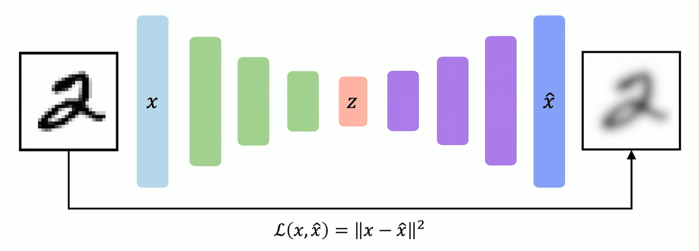
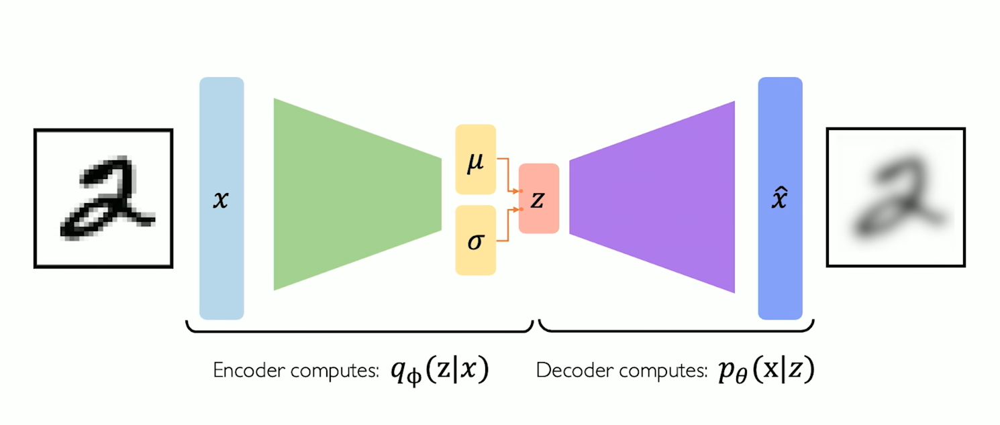
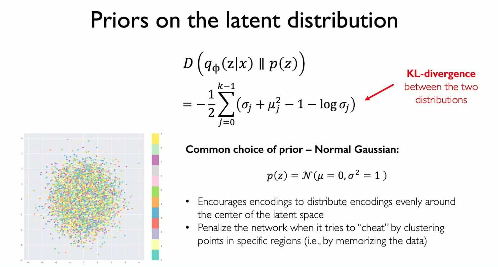
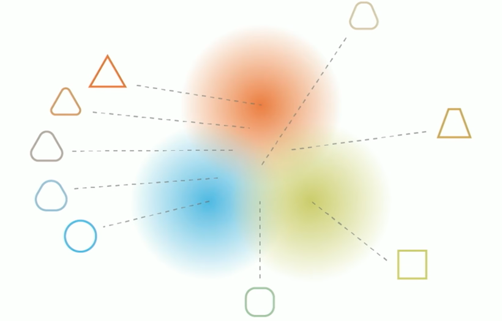
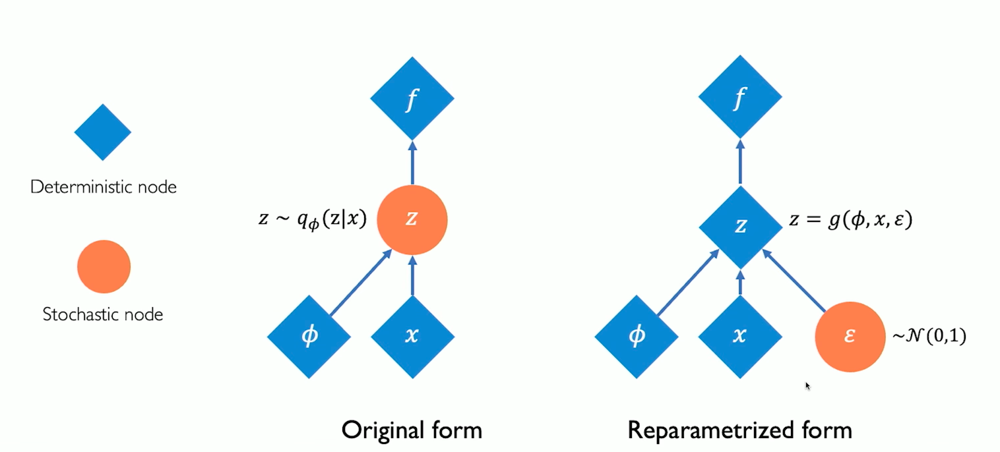
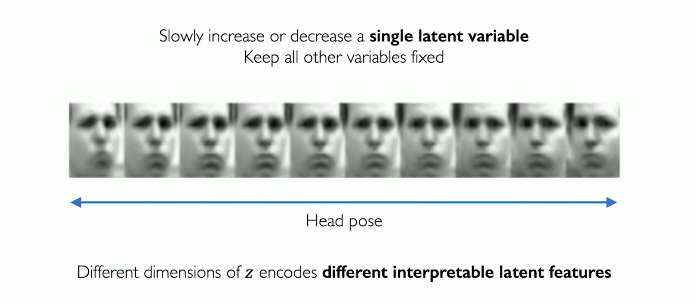
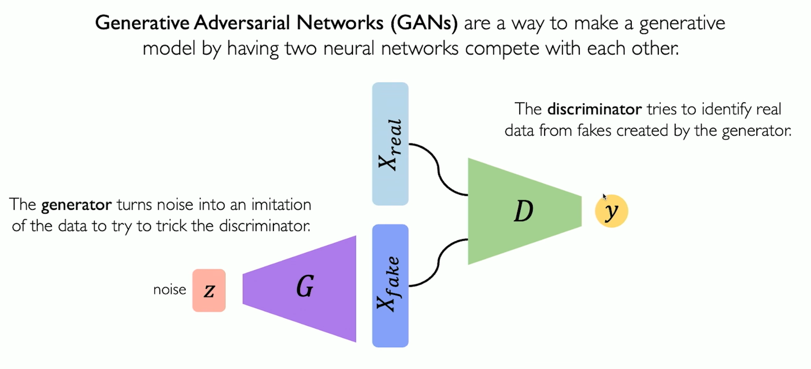
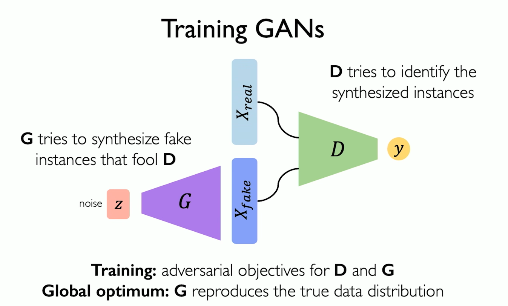
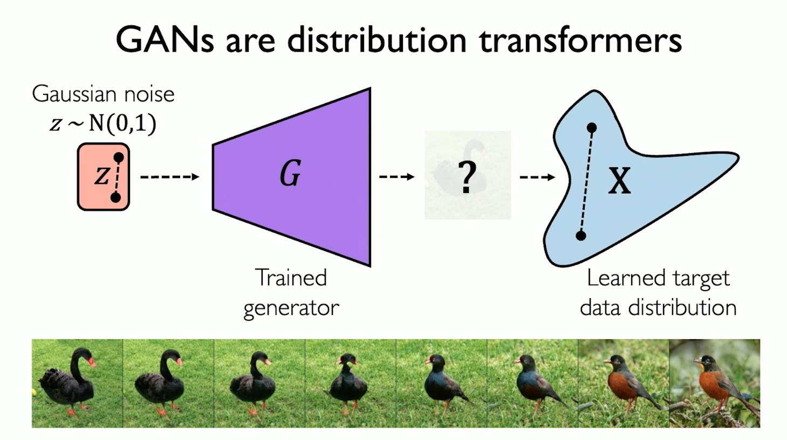

# Deep Generative Modeling
In questa sezione vedremo le basi della generative modeling. 

Vedremo come creare delle reti neurali, che non imparano soltanto pattern dai dati, ma che riescono a capire come modellare le distribuzioni dei dati, in modo tale da replicare queste distribuzioni per creare nuove istanze di dati.

Per vedere quanto sono potenti questi algorimti, vedremo un esempio di generazione ai, provate a indovinare quali di queste immagini non sono generate da AI:

In questo caso, l'immagine reale è la C, la A e la B sono state utilizzando Nano Banana 2 di Gemini.

## Addestramento supervisionato vs Addestramento non supervisionato
Fino ad ora, fino a questo capitolo, abbiamo sempre trattato reti neurali in cui l'addestramento era supervisionato (Feed Forward, RNN, CNN), ovvero dato un input, era dato anche l'output reale, la label.
L'obiettivo è sempre stato imparare un mapping funzionale tra x (input) e y (label, output): per classificare, regression, object detection, semantic segmentation etc.

Ma nel Deep Learning c'è una classe di problemi molto più grande, ovvero l'addestramento non supervisionato. Dove noi diamo alla nostra rete solo i dati in input senza alcuna label, senza alcun output reale. E l'obiettivo è quello è di capire, trovare, un modello che catturi queste distribuzioni di dati, in modo da imparare la struttura principale di questi dati, ovvero la distribuzione stessa.
Ad esempio: clustering, dimensionality reduction.

Quindi come funziona il **generative modeling**?
Prende in input esempi da una distribuzione e impara un modello di rete neurale che rappresenta questa distribuzione di probabilità.

Questo è il concetto principale ed essenziale della generative AI: catturare e imparare distribuzioni di probabilità dai dati.

Possiamo utilizzare questo concetto in un paio di modi:
- stima di densità: dati dei dati che seguono una distribuzione: impariamo un modello di questa distribuzione, ovvero descriviamo il modello probabilistico secondo cui questi dati sono distribuiti;
- se abbiamo effettivamente imparato una distribuzione di probabilità, a questo punto, possiamo generare usando questa distribuzione, questo modello.

Ma come facciamo ad imparare queste distribuzioni a partire dai dati?

Impariamo le feature più importanti di un dataset e le usiamo per costruire una rappresentazione più accurata e robusta della distribuzione reale. 
Questo ci permette anche di fare quello che è chiamato debiasing.

Sappiamo infatti che in molti casi reali, i dataset raccolti contengono bias, ovvero distorsioni sistematiche nei dati, spesso dovute al modo in cui sono stati raccolti. 

Ad esempio, un dataset di volti usato per il riconoscimento facciale potrebbe contenere molte più immagini di persone di una certa etnia rispetto ad altre, oppure un dataset medico potrebbe essere composto prevalentemente da pazienti maschi. 

I modelli addestrati su questi dataset finiscono per catturare e replicare gli stessi bias, producendo risultati meno accurati o addirittura discriminatori per i gruppi sottorappresentati.

Usando tecniche di generative modeling, possiamo fare in modo che il modello impari la distribuzione sottostante in modo più equilibrato, generando dati sintetici che correggono o bilanciano le distorsioni presenti nel dataset originale.

Un altro esempio imporante è quello della detection degli **Outlier**.
Ricordiamoci nuovamente, i modelli generativi vanno a catturare queste distribuzioni di probabilità dai dati. Nei casi di guida autonoma ad esempio, o pilotaggio automatico di un aereo, o nella medicina, possono esistere dei casi limite, dei casi che capitano pochissime volte (es. un animale che spunta sulla strada all'improvviso, nebbia fitta, etc), come facciamo a catturare queste casistiche? Come usiamo i modelli generativi per catturare questi eventi che potrebbero essere problematici, e correggere il comportamento?

### Perché i modelli generativi?
Il cuore dei modelli generativi è proprio questo: una volta appresa la distribuzione di probabilità dei dati, possiamo campionare da essa, ovvero estrarre nuove istanze che seguono quella stessa distribuzione, come se fossero dati reali.
Questo meccanismo è alla base di tutta la Generative AI moderna, e si applica a domini molto diversi:

- **linguaggio naturale**: i modelli come ChatGPT generano testo campionando da distribuzioni apprese su miliardi di parole. Il risultato sono risposte coerenti, traduzioni, riassunti, codice, etc;

- **immagini e video**;

- **molecole**: in ambito farmaceutico e biologico, i modelli generativi vengono usati per progettare nuove strutture molecolari, accelerando enormemente la ricerca su farmaci e proteine;

In tutti questi casi il principio è lo stesso: il modello non memorizza i dati, ma ne cattura la struttura profonda, e da quella struttura sa generare qualcosa di nuovo.

## Modelli a variabili latenti
Esistono principalmente due famiglie classiche di modelli generativi:

- **VAE** (Variational Autoencoders): erano il paradigma dominante fino a qualche anno fa, e restano fondamentali per capire i principi alla base della generative AI;

- **GAN** (Generative Adversarial Networks): hanno dominato la generazione di immagini per diversi anni, producendo risultati visivamente molto convincenti.

Recentemente una terza famiglia ha preso il sopravvento: i Diffusion Models, su cui si basano oggi sistemi come Stable Diffusion e DALL-E.

La domanda più importante però è: 

**cosa intendiamo per "caratteristiche più rilevanti" dei dati, e cosa significa latente?**

### Il mito della caverna
Per rispondere a questa domanda, usiamo una delle metafore filosofiche più famose: il mito della caverna di Platone.

Immaginiamo dei prigionieri incatenati in una caverna, con le spalle rivolte il muro. 
Dietro di loro brucia un fuoco, e tra il fuoco e i prigionieri passano delle figure. 
I prigionieri vedono solo le ombre proiettate sulla parete davanti a loro, non vedono mai gli oggetti reali.
Per i prigionieri, quelle ombre sono la realtà. 
Ma noi sappiamo che le ombre sono solo una rappresentazione ridotta di qualcosa di più ricco e complesso che esiste altrove.

Nel generative modeling funziona in modo analogo: i dati che osserviamo (immagini, testi, suoni), sono come le ombre sulla parete. 
Sono la manifestazione visibile di strutture più profonde e astratte che non osserviamo direttamente. 
Queste strutture nascoste sono le variabili latenti.
Lo spazio latente è quindi la stanza dietro la caverna: un mondo compresso e astratto dove vivono le caratteristiche essenziali dei dati. 
Il modello generativo impara a muoversi in questo spazio, e campionando da esso, proietta nuove ombre sulla parete, ovvero genera nuovi dati.

Modellando queste variabili latenti e utilizzando l'approccio di encoding, l'obiettivo è simile a questo mito della caverna, i dati vengono rappresentati da una distribuzione, ovvero quello che osserviamo, ma sotto sotto hanno delle altre caratteristiche.
Con il latent variable modeling il nostro obiettivo è quello di catturare questo comportamento, queste caratteristiche nascoste, e muoverci in questo spazio.

## Autoencoders
L'approccio dominante per fare questo è quello dell'encoding, ed è iniziato con il modello gli **Autoencoders**.

Questo è un approccio molto elegante, basato sull'idea di self-encodare gli input della rete neurale.
Il principio è quello di prendere in input dati grezzi, e addestrare la nostra rete neurale, attraverso diversi layer, per arrivare a una rappresentazione dello stesso input iniziale ma più snello, ovvero una rappresentazione delle feature più importanti di questi dati.
L'idea è quella di imparare un mapping che ci porti, dalla distribuzione dei dati iniziale, a questo spazio di dimensioni inferiori z.

In un certo senzo, questa è una sorta di compressione delle informazioni dei nostri dati, i nostri dati potrebbero essere molto complessi, ma riducendo la dimensione, potremmo muoverci sulle loro caratteristiche più importanti.

Ma qual è il nostro obiettivo? Perché vogliamo svolgere questo lavoro di compressione?
L'idea è molto intelligente, perché avremmo i dati input, abbiamo compresso questa distribuzione, e noi a partire da questo modello compresso, vogliamo provare a rigenerare i dati iniziali.

Questa è l'idea degli autoencoders, partire da questa dimensione di dati grezzi, costruire questa dimensione di dati compressi, di dati essenziali, e ritornare da questo encoding all'input space.

Il nostro obiettivo è quello di minimizzare questa Loss function a questo punto. La funzione loss non fa altro che guardare, ad esempio nel caso delle immagini, alla differenza pixel per pixel tra l'input e la ricostruzione dell'input.
Non c'è alcuna dipendenza da label, viene usato solo l'input.

Questa è un'idea molto potente. Perché iniziamo ad introdurre di comprimere dati molto complessi, input di grandi dimensioni in qualcosa di dimensione minore, lo spazio latente z.

Non vogliamo essere troppo larghi nella dimensione che andiamo a dfinire come compressa, perché non è questo il nostro obiettivo, e non vogliamo essere troppo stretti, perché comunque comprimere definisce un certo collo di bottiglia.

L'idea principale, è che abbiamo questo layer collo di bottiglia, questo set di variabili latenti z, che forza questo addestramento di una rappresentazione compressa, e possiamo addestrare il modello in maniera non supervisionata, ricostruendo questo input e calcolando e poi andando a minimizzare la loss.
Questa è proprio l'idea di self encoding che usano gli autoencoders.

In pratica questo approccio è molto elegante, ma non è molto utile per generare nuovi campioni, perché questo approccio è deterministico, ovvero, una volta che abbiamo addestrato l'autoencoder, se abbiamo l'input x e lo andiamo a ripassare allo stesso modello, output sarà esattamente lo stesso ogni volta. 

Quindi diciamo che non è molto utile per la generazione di campioni, perché non c'è nesssun concetto di variabilità dei campioni che andiamo a generare o di una distribuzione di probabilità.

Un'altra idea che è stata proposta per ovviare a questo problema, è quella dei VAEs, ovvero Variational AutoEncoders.

## VAEs (Variational AutoEncoders)
Qui la caratteristica principale si basa su: possiamo introdurre una sorta di distorsione probabilistica nella nostra idea di self encoding?

Con gli autoencoders standard, quello che produciamo è deterministico, il modello è addestrato, dando in input sempre la stessa cosa, otteniamo in output sempre la stessa cosa.

Nei VAEs, invece di avere una z che produce output deterministici, possiamo sostituirla con un'operazione di campionamento particolare. Invece di imparare le variabili latenti direttamente, andiamo ad imparare una media e una varianza per ogni variabile latente.
L'idea è che queste media e varianza possano parametrizzare questa distribuzione di probabilità delle variabili latenti, che ci consenta di campionare da queste variabili producendo nuovi output.

Questo significa che passiamo da imparare un set di variabili z, a imparare un vettore di medie e deviazioni standard per ognuna di queste variabili latenti.

Andiamo a formalizzare questo concetto, e pensiamo al nostro set di pesi, invece di un mapping deterministico, ora l'encoder, dato l'input x, cattura una distribuzione di probabilità sulle variabili latenti.
E il decoder invece sta calcolando una distribuzione di probabilità sul nostro spazio x, date le nostre variabili latenti z.

Noi andiamo a parametrizzare questo con dei pesi, phi e theta, che definiscono questi encoders e decoders rispettivamente.
Questi pesi sono esattamente ciò che viene imparato dalla nostra rete neurale.

Ma come facciamo a farlo?
Andiamo a vedere come costruiamo la Loss nei VAEs.

$$ \mathcal{L}(\phi, \theta, x) = \text{reconstruction loss} + \text{regularization term} $$

La reconstruction loss è la loss che abbiamo sempre visto fino ad ora.
E invece per questo termine di regolarizzazione? E' una sorta di loss della distribuzione, che serve proprio a rinforzare l'apprendimento di una buona distribuzione di probabilità.

La cosa più importante, è capire che questa loss, dipende da questi 2 set di pesi phi e theta, e che nell'apprendimento e addestramento della rete neurale, noi cercheremo di ottimizzare questa loss sulla base di questi due set di pesi degli encoder e dei decoder. Questi due termini vanno a dettare la funzione sulla quale andiamo ad applicare la discesa del gradiente.

Andiamo ad analizzare il termine di regolarizzazione della nostra loss.
Ricordiamoci che il nostro obiettivo è imparare la distribuzione delle variabili latenti parametrizzata da mu e sigma.
Come nel caso della recontruction loss, andiamo a calcolare una sorta di distanza, ma in questo caso è una distanza tra distribuzioni. 

L'encoder sta inferendo (ovvero decudendo, stimando qualcosa a partire dai dati osservati) questa distribuzione delle variabili latenti $$q_{\phi}(z|x)$$.

$$ D_{KL}(q_{\phi}(z|x) \parallel p(z)) $$

Questo termine misura quanto la distribuzione appresa dall'encoder $q_{\phi}(z|x)$ si discosta da una distribuzione di riferimento $p(z)$, che scegliamo essere una gaussiana standard $\mathcal{N}(0, I)$.

In pratica, stiamo dicendo alla rete: "impara una distribuzione sullo spazio latente, ma fai in modo che non si allontani troppo da una gaussiana semplice e regolare." 
Questo ha due effetti, che servono a soddisfare i requisiti di un buon spazio latente:

- **Regolarizza** lo spazio latente, evitando che il modello collassi in soluzioni degeneri;
- **Garantisce** che campionando dalla gaussiana standard, il decoder produca output significativi, ovvero che lo spazio latente sia continuo e navigabile.

In pratica, nelle VAE, non importa quanto è grande l'encoder o il decoder, viene quasi sempre usata la Gaussiana Standard come prior. 
Il termine D, può essere visto come una sorta di divergenza tra la distribuzione imparata e la Gaussiana Standard.

Perché usiamo proprio questa distribuzione? Per capirlo, dobbiamo ricordarci sempre un'altra domanda, ovvero l'intuizione del perché noi vogliamo imparare queste variabili latenti, perché vogliamo navigare questo spazio latente, e quali caratteristiche e proprietà deve avere questo spazio di variabili latenti? 

Ma quindi, quali sono le caratteristiche che uno spazio latente deve avere:

- **continuità**: punti vicini nello spazio latente, devono avere significato simile dopo il decoding;
- **completezza**: ci deve essere una sorta di struttura semantica che è catturata e imparata da questo spazio latente, in maniera tale che quando andiamo a campionare a partire dallo spazio latente, e andiamo a decodificare, l'output sia qualcosa di semanticamente sensato e significativo.

Senza alcuna regolarizzazione, il problema è che andremmo a perdere queste due caratteristiche desiderabili, potremmo avere punti vicini nello spazio latente che però non avrebbero un significato simile e neanche significativo dopo la decodifica.

Ma quindi, perché la normale nello specifico ci dà queste caratteristiche?
Qualsiasi funzione ci garantisce queste proprietà oppure la Normale ha qualcosa di speciale e la preferiamo?

Senza regolarizzazione, lo spazio latente può degenerare in due modi.

Per capirlo, immaginiamo di addestrare un VAE su immagini di volti umani: 
nello spazio latente tenderanno a formarsi dei gruppi naturali, detti cluster, 
uno per ogni caratteristica principale. Ad esempio, un cluster per i volti sorridenti, 
uno per i volti con gli occhiali, uno per i volti con i capelli scuri, e così via.

Il problema è che senza regolarizzazione questi cluster possono degenerare in due modi:

- **varianze piccole**: ogni cluster diventa un puntino isolato invece di una nuvola, 
ovvero una zona dello spazio con una certa estensione, in cui i punti vicini 
rappresentano variazioni simili dello stesso concetto. 
L'encoder mappa ogni volto in un punto preciso e separato. 
Se campionassimo un punto appena accanto, il decoder non saprebbe cosa produrre, 
generando un'immagine distorta e priva di senso;

- **medie distanti**: i cluster finiscono in zone lontane dello spazio latente, 
con grandi vuoti tra loro. Campionando un punto in uno di questi vuoti, 
il decoder genererebbe qualcosa di indefinito, né un volto sorridente né uno con 
gli occhiali, ma un'immagine corrotta e incomprensibile.

Il risultato è uno spazio latente frammentato e non navigabile.

Usando invece una gaussiana standard $\mathcal{N}(0, I)$ come prior, otteniamo 
esattamente l'opposto: le medie vengono spinte verso l'origine e le varianze 
vengono regolarizzate verso 1. Questo garantisce due proprietà fondamentali:

- **continuità**: le varianze regolarizzate costringono i cluster ad allargarsi e 
a sovrapporsi ai bordi. Muovendoci gradualmente nello spazio latente tra la zona 
dei volti sorridenti e quella dei volti con gli occhiali, vedremo transizioni fluide 
e naturali tra le due caratteristiche, generando volti che le combinano entrambe;

- **completezza**: le medie centrate attorno all'origine spingono i cluster vicini 
tra loro, eliminando i vuoti. In questo modo, ogni punto dello spazio latente produce 
un volto realistico e significativo quando passato al decoder, senza zone morte 
che generano immagini corrotte.

Questo significa che tutte le medie collasseranno a 0 e tutte le varianze a 1? No, perché nella loss abbiamo l'altro termine della ricostruzione.

Quindi quello che dobbiamo fare, è valorizzare per bene queste loss di ricostruzione e di regolarizzazione.

L'ultimo pezzo di questo puzzle è la backpropagation. 
Abbiamo detto che invece di imparare direttamente z, il nostro encoder impara 
mu e sigma, e da questi campiona z. Ma qui sorge un problema fondamentale.

La backpropagation funziona perché ogni operazione nella rete è differenziabile, 
ovvero il gradiente può scorrere indietro attraverso tutti i layer e aggiornare i pesi. 
Ma campionare da una distribuzione è un'operazione stocastica, casuale, 
e non è differenziabile. Non possiamo far scorrere il gradiente attraverso 
un'operazione casuale.

Come risolviamo questo problema?

Con un trucco molto elegante, chiamato **reparametrization trick**.

Invece di campionare z direttamente da $\mathcal{N}(\mu, \sigma^2)$, 
separiamo la parte casuale dalla parte che la rete deve imparare:

$$z = \mu + \sigma \odot \epsilon, \quad \epsilon \sim \mathcal{N}(0, I)$$

L'idea è semplice: campioniamo epsilon da una gaussiana standard fissa, 
che non dipende dai pesi della rete, e poi usiamo mu e sigma per 
trasformare questo campione nella z che vogliamo.

In questo modo la casualità è isolata in epsilon, che è un input esterno fisso, 
mentre mu e sigma rimangono operazioni differenziabili attraverso cui 
il gradiente può scorrere normalmente.

Il risultato è che possiamo addestrare il VAE end-to-end con la backpropagation, 
imparando allo stesso tempo a costruire uno spazio latente ben strutturato 
e a ricostruire gli input originali.

Questo diagramma rende visivo il problema e la soluzione.

Nella **forma originale** (a sinistra), z è un nodo stocastico (cerchio arancione): 
viene campionato direttamente dalla distribuzione $q_{\phi}(z|x)$, che dipende dai 
pesi phi e dall'input x. Il problema è che il gradiente, per propagarsi all'indietro 
da f verso phi, dovrebbe passare attraverso questo nodo stocastico, ma non può 
farlo: non esiste un modo per derivare un'operazione di campionamento casuale 
rispetto ai suoi parametri.

Nella **forma riparametrizzata** (a destra), spostiamo la casualità in un nodo 
separato: epsilon, campionato da una gaussiana standard $\mathcal{N}(0,1)$ che 
non dipende da phi né da x. A questo punto, z diventa un nodo deterministico 
(diamante blu), calcolato come una funzione $z = g(\phi, x, \epsilon)$.

Il risultato è che ora il gradiente può scorrere liberamente da f, attraverso z, 
fino a phi e x, perché tutto il percorso è composto da operazioni deterministiche 
e differenziabili. La parte casuale, epsilon, è isolata ai margini del grafo e 
non blocca più la backpropagation.

La cosa fighe delle VAEs, è che siccome andiamo ad apprendere questo spazio latente, abbiamo dei gradi di interpretabilità o controllo quando campioniamo. Nel caso di VAE ben addestrate, di buona qualità, possiamo pensare a queste variabili latenti come se catturassero delle feature individuali, in modo tale che se perturbiamo i valori delle variabili dello spazio, possiamo avere delle piccole differenze, in questo esempio nella posa della testa:

Potremo quindi mettere insieme CNNs e VAEs per fare debiasing di sistemi di detection facciale, e potremmo utilizzare le distribuzioni latenti per arrivare a questo obiettivo.

### Quindi, facciamo un recap finale di cosa facciamo nelle VAE:

**Come funziona il modello:**

1. **Comprimiamo** la rappresentazione dei nostri dati in uno spazio latente 
di dimensione inferiore, catturando le feature più importanti;

2. **ricostruiamo** l'input a partire da questa rappresentazione compressa, 
il che ci permette di addestrare il modello in modo non supervisionato, 
senza bisogno di label;

3. usiamo la **riparametrizzazione** per rendere il percorso end-to-end 
differenziabile, permettendo la backpropagation attraverso l'intero modello.

**Cosa possiamo fare con un VAE addestrato:**

4. **interpretare** lo spazio latente: muovendoci lungo una direzione 
specifica (perturbando z), possiamo osservare come cambia l'output in modo 
graduale e significativo, es. variando l'espressione di un volto o l'angolo 
di rotazione di un oggetto;

5. **generare** nuovi campioni, campionando direttamente dal prior 
$\mathcal{N}(0, I)$ e passando il risultato al decoder.

## GANs (Generative Adversarial Networks)

Fino ad ora abbiamo visto un approccio che impara *esplicitamente* una distribuzione 
di probabilità: l'encoder stima mu e sigma, il decoder ricostruisce, e la loss 
ci dice quanto siamo vicini alla distribuzione vera.

Ma cosa succederebbe se, invece di dire al modello *come* dovrebbe essere la 
distribuzione, lo facessimo scoprire da solo, attraverso una sfida?

Nel 2014 Ian Goodfellow propose un'idea che ha cambiato il volto della generative AI: 
le **Generative Adversarial Networks**. L'idea è tanto semplice quanto geniale: 
mettere due reti neurali una contro l'altra, in un gioco a somma zero, e lasciare 
che si migliorino a vicenda fino a che una delle due, il **generatore**, diventa 
così brava da creare dati indistinguibili da quelli reali.

Sono state davvero rivoluzionarie. Per anni, le GAN hanno prodotto le immagini 
sintetiche più realistiche mai viste, dando vita a deepfake, volti di persone 
inesistenti, opere d'arte generate da AI, e a un'intera famiglia di varianti 
(decine di architetture diverse, conosciute scherzosamente come lo "zoo delle GAN"). 
Anche se oggi sono in parte superate dai diffusion models, il principio 
adversarial alla loro base è ancora oggi una delle idee più influenti 
nel deep learning.

Vediamo come funziona questo "gioco".

### L'idea di base

Vediamo il problema da una prospettiva diversa rispetto ai VAE.

Invece di modellare *esplicitamente* la densità di probabilità dei dati (come 
facevamo con mu, sigma e la KL divergence), perché non proviamo semplicemente 
a **campionare** nuove istanze, saltando del tutto il problema di descrivere 
la distribuzione?

Il problema è che non possiamo campionare direttamente da una distribuzione 
complessa come quella dei dati reali, non abbiamo modo di descriverla in forma chiusa.

La soluzione è elegante: campioniamo da qualcosa di semplice, ad esempio del 
rumore casuale, e impariamo una **trasformazione** che porti questo rumore 
nello spazio dei dati reali.

Questo è esattamente il compito del **Generator Network G**: prende in input 
un vettore di rumore z, e lo trasforma in un campione $x_{fake}$, ovvero 
un'istanza sintetica che dovrebbe assomigliare ai dati reali x.

In altre parole, G impara una funzione che mappa uno spazio semplice e noto 
(il rumore) in uno spazio complesso e sconosciuto (la distribuzione dei dati reali).

Ma come facciamo a capire se G sta facendo un buon lavoro, ovvero se $x_{fake}$ 
è davvero simile a x? È qui che entra in gioco il secondo protagonista delle GAN.

A questo punto entra in gioco il secondo protagonista: il **Discriminator 
Network D**.

Il compito di D è semplice: guardare un'immagine x e dire se è **reale** 
(proveniente dal dataset) o **fake** (creata dal generatore G). In pratica, 
D è un classificatore binario, che produce un output y, la probabilità che 
l'input sia reale.

Il nome "adversarial" nasce proprio da questa dinamica: i due network hanno 
obiettivi opposti, e vengono addestrati insieme, in competizione.

- il **generatore** G riceve rumore z e produce $x_{fake}$, cercando di 
ingannare D, ovvero di produrre immagini che D classifichi come reali;

- il **discriminatore** D riceve sia $x_{real}$ (dati veri dal dataset) 
sia $x_{fake}$ (dati prodotti da G), e cerca di distinguerli correttamente.

È un vero e proprio gioco a somma zero: ogni volta che D migliora nel 
riconoscere i falsi, G è costretto a migliorare per produrre falsi più 
convincenti, e viceversa. Con il tempo, questo "braccio di ferro" spinge 
G a produrre output sempre più vicini alla distribuzione reale dei dati, 
fino a diventare praticamente indistinguibili.

$$ \arg \max_{D} \mathbb{E}_{\mathbf{z},\mathbf{x}} [ \log D(G(\mathbf{z})) + \log (1 - D(\mathbf{x})) ] $$

Ricordiamo che D produce un valore tra 0 e 1: più si avvicina a 1, più D è 
convinto che l'input sia reale.

Questa espressione è composta da due termini:

- $\log D(G(\mathbf{z}))$: riguarda i dati **fake**, prodotti dal generatore 
a partire dal rumore z. Il termine viene massimizzato quando $D(G(z))$ è 
vicino a 1, ovvero quando D classifica i dati fake come reali;

- $\log (1 - D(\mathbf{x}))$: riguarda i dati **reali** x. Il termine viene 
massimizzato quando $D(x)$ è vicino a 0, ovvero quando D classifica i dati 
reali come fake.

Massimizzando la somma di questi due termini, D verrebbe addestrato a fare 
esattamente l'opposto del suo compito: scambiare i dati veri per falsi e 
i dati falsi per veri.

### L'obiettivo

Ora che abbiamo visto cosa vuole D, possiamo completare il quadro aggiungendo G:

$$ \arg \min_{G} \max_{D} \; \mathbb{E}_{\mathbf{x}} [\log D(\mathbf{x})] + \mathbb{E}_{\mathbf{z}} [\log (1 - D(G(\mathbf{z})))] $$

Questa è la formulazione completa del gioco adversarial, e racchiude in 
un'unica espressione gli obiettivi opposti dei due network:

- **D** cerca di **massimizzare** questa espressione: vuole assegnare un 
punteggio alto $D(x)$ ai dati reali e un punteggio basso $D(G(z))$ ai dati 
fake, per distinguerli correttamente;

- **G** cerca di **minimizzare** la stessa espressione: vuole che 
$D(G(z))$ sia alto, ovvero che il discriminatore scambi i suoi output 
fake per dati reali. Per minimizzare l'espressione, G deve quindi 
rendere $\log(1-D(G(z)))$ il più piccolo possibile, spingendo $D(G(z))$ 
verso 1.

Durante l'addestramento, alterniamo i due passi: aggiorniamo D per 
migliorare la sua capacità di distinguere reale da fake, poi aggiorniamo 
G per migliorare la sua capacità di ingannare D. I due network si 
inseguono in un equilibrio dinamico, finché G non diventa così bravo 
che D non riesce più a fare meglio del 50% di accuratezza, ovvero non 
distingue più reale da fake.

Una volta addestrata, possiamo pensare a G come a una funzione che 
**trasforma** una distribuzione semplice in una complessa: prende punti 
da un rumore gaussiano $z \sim \mathcal{N}(0,1)$, e li mappa nello spazio 
dei dati reali x.

Ma cosa succede esattamente in questa trasformazione? Cosa "vede" G 
quando guarda un punto z?

L'immagine in basso lo mostra in modo molto efficace: prendiamo due punti 
nello spazio latente (z1 e z2), e ci muoviamo gradualmente dall'uno 
all'altro, generando un'immagine per ogni punto intermedio. Il risultato 
è una transizione fluida e continua, da un cigno nero a un pettirosso, 
passando per forme intermedie plausibili.

Questo è esattamente lo stesso principio di continuità che abbiamo visto 
parlando dei VAE: lo spazio latente non è una collezione di punti isolati, 
ma uno spazio continuo e navigabile, in cui muoversi gradualmente produce 
variazioni graduali e coerenti nell'output generato.

### CycleGANs: trasformare un dominio in un altro

Abbiamo visto le GAN come trasformatori: prendono punti da un rumore 
gaussiano e li mappano nello spazio dei dati reali (Gaussian noise → 
target data manifold).

Ma se generalizziamo questa idea, perché limitarci a partire dal rumore? 
Possiamo usare lo stesso principio per trasformare un **dominio di dati 
in un altro**: data manifold X → data manifold Y. Questa è l'idea alla 
base delle **CycleGAN**.

#### Come funziona

Una CycleGAN impara due trasformazioni contemporaneamente, usando 
**dati non appaiati** (unpaired data), ovvero senza bisogno di esempi 
corrispondenti uno a uno tra i due domini:

- un generatore **G** che trasforma X in Y;
- un generatore **F** che trasforma Y in X (il percorso inverso);
- due discriminatori, $D_X$ e $D_Y$, che verificano se gli output 
generati sono indistinguibili dai dati reali nel rispettivo dominio.

Il nome "cycle" viene dal fatto che il modello viene addestrato anche a 
rispettare un **ciclo di consistenza**: se trasformiamo un'immagine da X 
a Y con G, e poi la riportiamo da Y a X con F, dovremmo ottenere 
(circa) l'immagine originale. Questo vincolo è ciò che permette di 
addestrare il modello senza bisogno di coppie di immagini corrispondenti.

L'esempio classico è la trasformazione cavallo-zebra: il modello impara 
ad "aggiungere strisce" a un cavallo per farlo sembrare una zebra, e 
viceversa, senza aver mai visto una coppia foto-cavallo/foto-zebra 
dello stesso animale nella stessa posa.

#### Non solo immagini

Questo principio non si limita alle immagini. Lo stesso approccio può 
essere applicato a qualsiasi tipo di dato che possa essere rappresentato 
come un'immagine, per esempio l'**audio**: una forma d'onda può essere 
convertita in uno **spettrogramma** (una rappresentazione visiva delle 
frequenze nel tempo), e una CycleGAN può imparare a trasformare lo 
spettrogramma di una voce (o di uno strumento) in quello di un altro, 
per poi ricostruire la forma d'onda risultante. È il principio alla base 
di molte applicazioni di voice conversion e style transfer audio.

### Quando i due si combinano: i deepfake

Le due applicazioni che abbiamo visto, trasformazione di immagini e 
trasformazione di audio, possono essere combinate insieme. Questo è 
esattamente il principio alla base dei **deepfake**: usare modelli 
generativi per sostituire contemporaneamente il volto e la voce di una 
persona in un video con quelli di un'altra.

Il volto viene trasformato con tecniche di image-to-image translation 
(come le CycleGAN viste sopra, o varianti più moderne), frame per frame, 
mantenendo espressioni e movimenti coerenti con il video originale. 
La voce, allo stesso tempo, viene convertita tramite tecniche di voice 
conversion sugli spettrogrammi, in modo da far corrispondere il timbro 
e l'intonazione della persona target.

Il risultato è un video sintetico in cui una persona sembra dire e fare 
cose che non ha mai detto né fatto, generato interamente combinando 
queste tecniche generative.

Questa è anche l'occasione per riflettere su un punto importante: la 
stessa tecnologia che usiamo per il debiasing dei dataset, per la 
generazione artistica, o per la sintesi vocale assistiva, può essere 
usata per creare contenuti falsi estremamente convincenti. Capire come 
funzionano questi modelli è il primo passo per riconoscerne i limiti e 
i rischi, e per sviluppare strumenti capaci di rilevare contenuti 
generati artificialmente.

## Riepilogo: due strade per la generazione

Abbiamo visto due famiglie di modelli generativi, due strade diverse per 
raggiungere lo stesso obiettivo, generare nuovi dati a partire da una 
distribuzione appresa.

**Autoencoders e Variational Autoencoders (VAE)**

Imparano uno **spazio latente** di dimensione inferiore, comprimendo i 
dati in poche variabili essenziali, e poi **campionano** da questo spazio 
per generare ricostruzioni dell'input. Il punto di forza è la struttura 
esplicita e interpretabile dello spazio latente: possiamo muoverci al suo 
interno e osservare transizioni continue e significative tra gli output.

**Generative Adversarial Networks (GAN)**

Funzionano in modo completamente diverso: due reti, un **generatore** e 
un **discriminatore**, competono tra loro in un gioco adversarial. Il 
generatore impara a trasformare rumore in dati realistici, spinto dal 
tentativo di ingannare il discriminatore. Il punto di forza è la qualità 
e il realismo degli output generati, spesso superiore a quella dei VAE.

Entrambi gli approcci condividono l'idea centrale di questa sezione: 
catturare la distribuzione di probabilità dei dati per poterne generare 
di nuovi. Nelle prossime sezioni vedremo come questi principi si 
evolvono ulteriormente nei **diffusion models**, l'architettura alla base 
dei sistemi di generazione di immagini più avanzati di oggi.