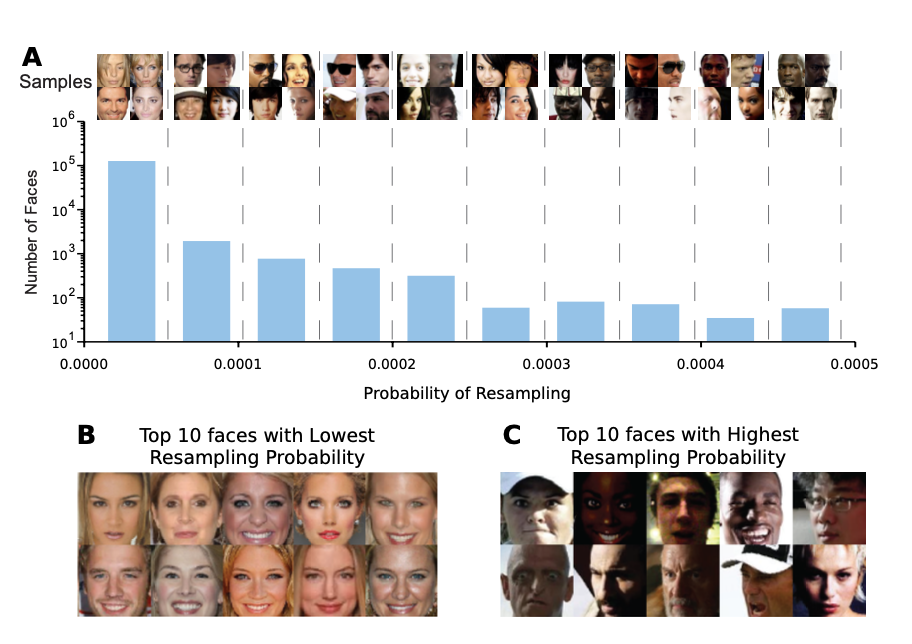
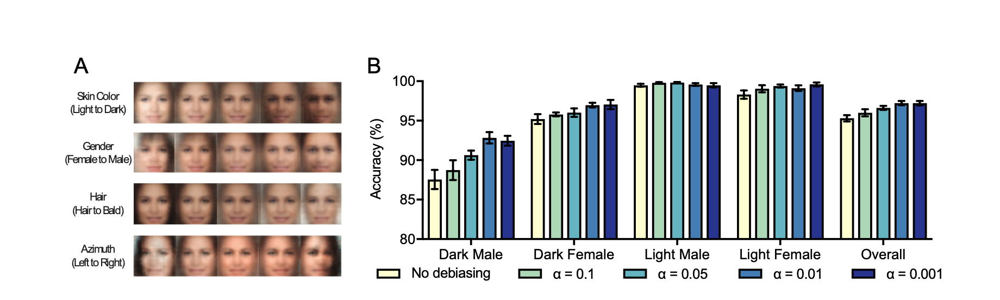

# Uncovering and Mitigating Algorithmic Bias through Learned Latent Structure

## ABSTRACT

Recent research has highlighted the vulnerability to bias (systematic prejudices that lead to unfair or distorted outcomes) of modern machine learning based systems, especially against segments of society that are under-represented in the training data.

In this work, a new tunable algorithm is developed to mitigate the hidden, and potentially unknown, biases present within the training data.

This algorithm fuses the original learning task with a Variational Autoencoder (VAE, a model that learns to compress data into a compact latent space and to reconstruct it, thereby learning which hidden characteristics describe it), in order to learn the latent structure of the dataset (the set of characteristics that are not directly observable, which the model discovers on its own and which explain the differences between data points) and to then use the learned latent distributions to re-weight the importance of certain data points during training (that is, giving more weight, during learning, to the less represented examples).

Although this method is generalizable to different data modalities and learning tasks, in this work the algorithm is used to address the problem of racial and gender bias in facial detection systems.

The algorithm is evaluated on the Pilot Parliaments Benchmark (PPB, a reference dataset containing face images of parliamentarians from different countries, created specifically to test the fairness of computer vision systems with respect to gender and skin tone), and it is shown how the proposed debiasing approach (bias correction) increases overall performance and reduces bias across categories.

## 1 INTRODUCTION

Machine Learning (ML) systems make decisions that increasingly impact the daily life of human beings and society in general. For example, ML and artificial intelligence (AI) are already being used to control autonomous vehicles end-to-end (that is, with a single neural network going directly from the input, such as camera images, to the output, such as steering commands, without hand-designed intermediate modules), to determine sentence lengths for convicted people, to establish the order in which a person views news online, or even to diagnose and treat patients.

The development and deployment of fair and unbiased AI systems is essential to prevent unintended side effects and to ensure the long-term acceptance of these algorithms.

Even a seemingly simple task like facial recognition has proven to be subject to extreme amounts of algorithmic bias against certain demographic groups. For example, Klare et al. analyzed the facial detection system used by US law enforcement and found significantly lower accuracy for dark-skinned women between 18 and 30 years old. This is particularly concerning because these facial recognition systems rarely operate in isolation: they are often part of larger surveillance or suspect identification pipelines, where a system error can have concrete consequences on people.

Although deep learning based systems have achieved state-of-the-art performance on many of these tasks, it has also been shown that algorithms trained on distorted data produce algorithmic discrimination. Benchmarks that quantify discrimination have recently emerged, and even datasets designed to evaluate the fairness of these algorithms. However, the problem of heavily imbalanced training datasets (in which some categories or groups are represented far less than others) and the question of how to integrate debiasing capabilities into AI algorithms remain largely unsolved.

This paper addresses the challenge of integrating debiasing capabilities directly into the model's training process, so that it adapts automatically and without supervision (that is, without needing to manually label which examples are under-represented) to the shortcomings of the training data.

The approach is based on an end-to-end deep learning algorithm that simultaneously learns the desired task (for example facial detection) and the latent structure underlying the training data. Learning this latent distribution in an unsupervised way (without human-provided labels, letting the model discover the patterns in the data on its own) makes it possible to surface the hidden or implicit biases present in the data.

The algorithm, built on top of a VAE, is able to identify the under-represented examples in the training dataset and, as a consequence, to increase the probability with which the learning algorithm samples these data points.

The algorithm is applicable to a wide range of computer vision tasks and has already been used successfully to debias end-to-end controllers for autonomous vehicles. In this paper it is shown how it can also be used to correct the biases of a facial detection system trained on a distorted dataset, additionally providing interpretations of the learned latent variables (that is, making it humanly understandable what the hidden characteristics discovered by the model concretely represent, such as pose or skin tone), which are precisely the variables the algorithm acts on to correct the biases.

Finally, the performance of the debiased model is compared with that of a standard deep learning classifier (that is, one not modified to correct biases), evaluating racial and gender biases on the Pilot Parliaments Benchmark dataset.

The main contributions of this paper are:

- a new tunable debiasing algorithm that uses the learned latent variables to adjust the sampling probabilities of individual data points during training;
- a semi-supervised model (combining supervised learning on labeled data and unsupervised learning on the structure of the data) to simultaneously learn a debiased classifier and the underlying latent variables governing the given classes;
- an analysis of the method applied to facial detection with distorted training data, and an evaluation to measure algorithmic fairness across different ethnicities and genders.

## 2 RELATED WORK

Interventions that seek to introduce fairness into machine learning pipelines generally fall into one of these 3 categories:

- pre-processing interventions, applied to the data before training;
- in-processing interventions, applied during training;
- post-processing interventions, applied after training.

Many pre and in-processing methods rely on artificially generated data to correct imbalances, or on resampling techniques (that is, the repeated selection of certain examples from the dataset to modify its composition). These approaches, however, almost always focus on imbalances between different classes (for example: few pictures of cats compared to many of dogs), not on the variability within a single class (for example: within the "faces" class, some ethnicities, ages, or poses are under-represented compared to others), and they do not exploit any information about the structure of the underlying latent characteristics.

Learning the latent structure of data has a long history in machine learning, including techniques such as Expectation-Maximization (an iterative algorithm that estimates the parameters of a model in the presence of hidden variables), topic modeling (which discovers the hidden "themes" in collections of documents), latent-SVMs, and, more recently, Variational Autoencoders themselves.

The present work proposes a new VAE-based approach that performs resampling based on the latent structure of the data, corrects biases automatically during training, and requires no pre-processing or manual annotation before training or testing.

**Resampling for class imbalance**: resampling techniques have mostly focused on imbalances between classes, not on biases within a single class. For example, duplicating examples of the minority class (that is, creating multiple copies of the less numerous examples to balance the dataset) has been used as a pre-processing step to correct imbalances, but it cannot adapt dynamically during training. Furthermore, extending these methods to biases within a class would require knowing the latent structure of the data in advance, with the consequent need for manual annotation of the desired characteristics (that is, labeling them by hand, an expensive and subjective process). The approach proposed here, on the contrary, automatically corrects the variability within classes during training, learning the latent structure from scratch and in an unsupervised way.

**Generating debiased data**: some recent works use generative models (models that learn to create new data similar to the observed data) or data transformations to produce training datasets that are fairer than the original one. Sattigeri et al., for example, used a generative adversarial network (GAN, a model composed of two neural networks competing against each other: one generates synthetic data, the other tries to distinguish it from real data) to reconstruct a dataset similar to the original one but fairer with respect to certain attributes. Pre-processing transformations to reduce discrimination have also been proposed, but these are static methods, not learned adaptively during training, and they do not provide realistic training examples. The approach proposed here, instead, does not rely on artificially generated data, but uses a subset of the original dataset, resampled to be more representative.

**Clustering to uncover biases**: k-means clustering (a technique that automatically groups data into a predefined number of mutually similar groups, called clusters) has also been used to identify groups in the data before training, in order to guide the resampling toward a smaller and more representative set of examples. This approach, however, does not scale to high-dimensional data (that is, data with a very large number of characteristics, such as the individual pixels of an image), does not work when there is no clear notion of "cluster" in the data, and requires substantial pre-processing to extract the relevant features. The algorithm proposed here overcomes these limits by directly learning the underlying latent structure through a variational approach (based on VAEs, which mathematically approximates the distribution of the latent characteristics in the data).

## 3 METHODOLOGY

### 3.1 Problem setup

Consider the problem of binary classification (in which the model must assign to each example one of two possible labels, for example "face" or "not face"). We have a set of training data pairs $\mathcal{D}_{train} = \{(x^{(i)}, y^{(i)})\}_{i=1}^{n}$, made of features $x \in \mathbb{R}^m$ (in our case, the pixels of an image) and labels $y \in \mathbb{R}^d$.

The goal is to find a function $f: X \rightarrow Y$, parameterized by $\theta$ (the weights of the neural network), that minimizes a certain loss $\mathcal{L}(\theta)$ (the cost function, which measures how much the model is wrong) over the entire training dataset. In other words, we try to solve the following optimization problem:

$$\theta^* = \arg\min_{\theta} \frac{1}{n} \sum_{i=1}^{n} \mathcal{L}_i(\theta) \tag{1}$$

Given a new test example $(x, y)$, the classifier should ideally produce an output $\hat{y} = f_\theta(x)$ "close" to $y$, where the notion of closeness is defined by the original loss.

Now assume that each data point also has an associated continuous latent vector $z \in \mathbb{R}^k$, which captures the hidden and sensitive characteristics of the example (in the case of faces: skin tone, gender, age, pose, and so on). We can then formalize the notion of a biased classifier as follows:

**Definition 1.** *A classifier $f_\theta(x)$ is biased if its decision changes when exposed to additional inputs of sensitive characteristics. In other words, a classifier is fair with respect to a set of latent characteristics $z$ if: $f_\theta(x) = f_\theta(x, z)$.*

For example, when deciding whether an image contains a face or not, the skin color, gender, or even the age of the person are all underlying latent variables, and changing any of their values should not alter the final decision of the classifier.

To guarantee the fairness of a classifier with respect to these latent variables, the dataset should contain samples distributed approximately uniformly over the latent space. In other words, the training distribution itself should not over-represent a certain category at the expense of others.

Careful: this is different from saying that the dataset must be balanced with respect to the classes (that is, containing roughly the same number of faces and non-faces). What is being said is that, within a single class, the unobserved latent variables should also be balanced. This way, all instances of the same class will be treated fairly by the classifier: even pushing a latent variable to its opposite extreme (for example skin tone from light to dark), the accuracy of the classifier should not change.

Furthermore, if we have a test set labeled with respect to the space of sensitive latent variables $z$, we can measure the bias of the classifier by computing its accuracy on each of the sensitive categories (for example the different skin tones). While the overall accuracy of the classifier is the average of the accuracies over all sensitive categories, the bias is the variance of the accuracies across the different realizations of these categories (for example light faces versus dark faces).

This definition is very intuitive: if a classifier performs equally well regardless of the value of a specific latent variable (for example skin tone), the variance of its accuracies will be zero, and the classifier is said to be unbiased with respect to that variable. If, instead, some values of the latent variable make the classifier perform better or worse, the variance of the accuracies increases, and with it the overall bias of the classifier.

It would be possible to use a set of manually defined sensitive variables to guarantee fair representation during training, but this would require manually annotating every variable over the entire dataset, which is very expensive in terms of time. Moreover, this approach is subject to the potential human bias in choosing which variables to consider sensitive and which not. In this work, the problem is solved by learning the latent variables of the class in a completely unsupervised way, and then using them to adaptively resample the dataset during training. The next subsection describes the architecture used to learn the latent variables.

### 3.2 Learning latent structure with Variational Autoencoders

In this work, the latent variables of a class are *learned* in a completely unsupervised way, and then used to adaptively resample the dataset during training. To do this, an extension of the VAE architecture is proposed: the debiasing-VAE (DB-VAE).

The encoder portion of the VAE (the network that compresses the input into the latent space) learns an approximation $q_\phi(z|x)$ of the true distribution of the latent variables given a data point. Unlike classic VAE architectures, $d$ additional output variables are also introduced, with $\hat{y} \in \mathbb{R}^d$. With $k$ latent variables and $d$ output variables, the encoder produces $2k + d$ activations: $2k$ correspond to $\mu \in \mathbb{R}^k$ and $\Sigma = Diag[\sigma^2] \succ 0$ (the mean and variance defining the distribution of $z$; in VAEs, in fact, the encoder does not produce a single point in the latent space, but a Gaussian distribution to sample from), plus the $d$ activations of the output $\hat{y}$.

The key point is this: in order to keep learning the original supervised task as well, the $d$ output variables are explicitly supervised (that is, compared with the true labels during training). This transforms the VAE from a completely unsupervised model into a semi-supervised model: some latent variables are learned implicitly by trying to reconstruct the input, while the others are explicitly supervised for a specific task (for example classification). In the case of a binary classifier ($\hat{y} \in \{0, 1\}$), the DB-VAE model learns an encoding of $k$ latent variables, that is $\{z_i\}_{i \in \{1,k\}}$, plus a single variable dedicated to classification: $z_0 = \hat{y}$.

A decoder network mirroring the encoder is then used to reconstruct the input from the latent space, approximating $p_\theta(x|z)$. VAEs use the reparameterization trick to be able to compute gradients through the sampling step, which by itself would not be differentiable: one samples $\epsilon \sim \mathcal{N}(0, I)$ from a standard Gaussian and computes $z = \mu(x) + \Sigma^{\frac{1}{2}}(x) \circ \epsilon$. This way, the randomness is isolated in $\epsilon$ and the gradients can flow through $\mu$ and $\Sigma$. The decoded reconstruction makes the unsupervised learning of the latent variables possible during training, and is therefore necessary for the automatic debiasing of the data.

The network is trained end-to-end via backpropagation with a three-component loss: a supervised loss for classification, a reconstruction loss, and a latent loss for the unsupervised variables. For a binary classification task, for example:

- the supervised loss $\mathcal{L}_y(y, \hat{y})$ is the cross-entropy (the standard loss for classification, which penalizes the model when it assigns low probability to the correct class);
- the reconstruction loss $\mathcal{L}_x(x, \hat{x})$ is the $L_p$ norm between the input and the reconstructed output (that is, a pixel by pixel distance measure between the original and reconstructed image);
- the latent loss $\mathcal{L}_{KL}(\mu, \sigma)$ is the Kullback-Leibler divergence (a measure of how much the learned latent distribution deviates from the standard Gaussian used as reference; it serves to keep the latent space regular and well organized).

The total loss is a weighted combination of these three components:

$$\mathcal{L}_{TOTAL} = c_1 \underbrace{\left[\sum_{i \in \{0,1\}} y_i \log\left(\frac{1}{\hat{y}_i}\right)\right]}_{\mathcal{L}_y(y,\hat{y})} + c_2 \underbrace{\left[\|x - \hat{x}\|_p\right]}_{\mathcal{L}_x(x,\hat{x})} + c_3 \underbrace{\left[\frac{1}{2}\sum_{j=0}^{k-1}(\sigma_j + \mu_j^2 - 1 - \log(\sigma_j))\right]}_{\mathcal{L}_{KL}(\mu,\sigma)} \tag{2}$$

where $c_1, c_2, c_3$ are the weighting coefficients that regulate the relative importance of each of the three losses.

As a term of comparison, the baseline model (the standard reference model against which the results are compared) used for the task has an architecture similar to the DB-VAE, but without the unsupervised latent variables and without the decoder network, and it is trained using only the supervised loss.

An important clarification concerns the examples belonging to classes that one does *not* want to debias. In the facial detection problem, for example, what mostly matters is that the positive dataset (the faces) is fair and unbiased, while correcting the biases of the negative examples in which there is no face matters little. For these negative samples, the gradients coming from the decoder and the latent space are blocked and not backpropagated. In practice, for these classes only the encoder is trained to optimize the supervised loss.

### 3.3 Algorithm for automatic debiasing

This section presents the adaptive resampling algorithm for the training data, based on the latent structure learned by the DB-VAE model. By discarding the over-represented regions of the latent space in proportion to their frequency, the probability of selecting the rarer data for training is increased. This happens adaptively, while the latent variables themselves are being learned during training. The debiasing approach therefore takes into account the complete distribution of the underlying characteristics in the training data.

The training dataset is passed through the encoder network, which provides an estimate $Q(z|X)$ of the latent distribution. The goal is to increase the relative frequency of rare data points by sampling the under-represented regions of the latent space more often. To do this, the distribution of the latent space is approximated with a histogram $\hat{Q}(z|X)$, whose dimensionality is defined by the number of latent variables $k$.

Here, however, a practical problem arises: a joint histogram over $k$ dimensions quickly becomes intractable as $k$ grows (it would require a number of cells exponential in $k$, the so-called curse of dimensionality). To get around the problem, a further simplification is made by using independent histograms to approximate the joint distribution. In practice, an independent histogram $\hat{Q}_i(z_i|X)$ is defined for each latent variable $z_i$:

$$\hat{Q}(z|X) \propto \prod_i \hat{Q}_i(z_i|X) \tag{3}$$

This makes it possible to approximate $Q(z|X)$ in a simple way, based on the frequency distribution of each learned latent variable.

Finally, a single parameter $\alpha$ is introduced to regulate the degree of debiasing applied during training. The probability of selecting a data point $x$ is defined as $\mathcal{W}(z(x)|X)$, parameterized by the debiasing parameter $\alpha$:

$$\mathcal{W}(z(x)|X) \propto \prod_i \frac{1}{\hat{Q}_i(z_i(x)|X) + \alpha} \tag{4}$$

The intuition behind this formula: if an example falls in a very frequent region of the latent space, $\hat{Q}_i$ is large and therefore its probability of being selected is low; if it falls in a rare region, $\hat{Q}_i$ is small and the selection probability is high. The parameter $\alpha$ in the denominator dampens this effect.

The pseudocode for training the DB-VAE is reported in Algorithm 1. At every epoch (a complete pass over the entire training dataset), all inputs $x$ of the original dataset $X$ are propagated through the model to evaluate the corresponding latent variables $z(x)$, and the histograms $\hat{Q}_i(z_i(x)|X)$ are updated accordingly. During training, each new batch is drawn by keeping the inputs $x$ of the original dataset $X$ with probability $\mathcal{W}(z(x)|X)$.

Training on the debiased batch pushes the classifier toward a choice of parameters that works better on the rare cases, without a strong deterioration of performance on the common training examples. The most important point is that the debiasing is not manually specified in advance, but is based on the *learned* latent variables.

**Algorithm 1** - Adaptive resampling for the automatic debiasing of the DB-VAE architecture

**Require:** training data $\{X, Y\}$, batch size $b$

1. Initialize the weights $\{\phi, \theta\}$
2. **for** each epoch $E_t$ **do**
3. &nbsp;&nbsp;&nbsp;&nbsp;Sample $z \sim q_\phi(z|X)$
4. &nbsp;&nbsp;&nbsp;&nbsp;Update $\hat{Q}_i(z_i(x)|X)$
5. &nbsp;&nbsp;&nbsp;&nbsp;$\mathcal{W}(z(x)|X) \leftarrow \prod_i \frac{1}{\hat{Q}_i(z_i(x)|X) + \alpha}$
6. &nbsp;&nbsp;&nbsp;&nbsp;**while** $iter < \frac{n}{b}$ **do**
7. &nbsp;&nbsp;&nbsp;&nbsp;&nbsp;&nbsp;&nbsp;&nbsp;Sample $x_{batch} \sim \mathcal{W}(z(x)|X)$
8. &nbsp;&nbsp;&nbsp;&nbsp;&nbsp;&nbsp;&nbsp;&nbsp;$L(\phi, \theta) \leftarrow \frac{1}{b}\sum_{i \in x_{batch}} \mathcal{L}_i(\phi, \theta)$
9. &nbsp;&nbsp;&nbsp;&nbsp;&nbsp;&nbsp;&nbsp;&nbsp;Update: $[w \leftarrow w - \eta\nabla_{\phi,\theta}\mathcal{L}(\phi, \theta)]_{w \in \{\phi,\theta\}}$
10. &nbsp;&nbsp;&nbsp;&nbsp;**end while**
11. **end for**

Intuitively, the parameter $\alpha$ regulates the degree of debiasing. When $\alpha \rightarrow 0$, the subsampled training set tends to become uniform with respect to the latent variables $z$ (maximum debiasing: all regions of the latent space are sampled equally). When $\alpha \rightarrow \infty$, the subsampled training set tends to a uniform random sample of the original training dataset (that is, no debiasing: the $\alpha$ term dominates the denominator and all probabilities become equal).

## 4 EXPERIMENTS

To validate the debiasing algorithm on a real problem with significant social impact, a debiased facial detector is learned using potentially distorted training data. This section defines the facial detection problem, describes the datasets used, and outlines the model training, the debiasing, and the evaluation.

For the facial detection problem, a set of training data pairs $\mathcal{D}_{train} = \{(x^{(i)}, y^{(i)})\}_{i=1}^{n}$ is given, where $x^{(i)}$ are the raw pixel values of an image patch and $y^{(i)} \in \{0, 1\}$ are the respective labels, indicating the presence of a face.

The goal is to guarantee that the set of positive examples used to train the classifier is fair and unbiased. The positive training data could indeed be distorted with respect to some attributes, such as skin tone, in the sense that particular values of these attributes could appear more or less frequently than others.

In the experiments, a full DB-VAE model is therefore trained to learn the latent structure underlying the positive images (the faces), and the adaptive resampling approach of Algorithm 1 is used to debias the model with respect to facial characteristics. For the negative examples, only the encoder portion of the network is trained, as described in Section 3. The performance of the debiased models is evaluated against the standard (biased) classifiers on the PPB dataset, providing estimates of the precision and bias of each model as performance metrics.

### 4.1 Datasets

The classifiers are trained on a dataset of $n = 4 \times 10^5$ images, composed of $2 \times 10^5$ positive examples (images of faces) and as many negative ones (images of non-faces), split 80% and 20% respectively into training and validation sets. The positive examples come from the CelebA dataset (a large public dataset of celebrity faces) and were cropped into square format based on the annotated face bounding box. The negative examples come from the ImageNet dataset, from a wide variety of non-human categories. All images were resized to 64 × 64 pixels.

After training, the debiasing algorithm is evaluated on the PPB test set, which consists of images of 1270 male and female parliamentarians from various African and European countries. The images are consistent in terms of pose, lighting, and facial expression, and the dataset has parity in both skin tone and gender. The gender of each face is annotated with the labels "Male" and "Female". The skin tone annotations are based on the Fitzpatrick scale (a dermatological system for classifying skin according to its reaction to the sun), with each image labeled as "Lighter" or "Darker".

### 4.2 Training the models

For the classic facial detection task, a convolutional neural network is trained with four convolutional layers in sequence (5 × 5 filters with 2 × 2 stride, where the stride is the step with which the filter slides over the image) for feature extraction. The final classification happens through two additional fully connected layers (layers in which every neuron is connected to all those of the previous layer), with 1000 and 1 neurons respectively. All layers of the network use ReLU activation and batch normalization (a technique that normalizes the activations to stabilize and speed up training).

The DB-VAE architecture shares this same classification network for the encoder, except for the final fully connected layer, which now produces $k$ additional latent variables for a total of $2k + 1$ activations. A decoder, mirroring the encoder with 2 fully connected layers and 4 deconvolutional layers (layers that perform the inverse operation of convolution, reconstructing an image from a compressed representation), is then used to reconstruct the original input image. The models are trained by minimizing the empirical loss defined in Eq. 2, with $L_2$ reconstruction loss.

In the experiments, moreover, all gradients coming from the decoder are blocked when $y = 0$, that is, for the negative examples, since we only want to debias the positive face examples. In addition to the standard classification network without debiasing, DB-VAE models with increasing degrees of debiasing, defined by the parameter $\alpha$, were trained for 50 epochs, evaluating their performance on the validation set. Each model was retrained from scratch 5 times for greater statistical robustness of the results.

### 4.3 Automatic debiasing of facial detection systems

This section explores the output of the debiasing algorithm and provides an extended evaluation of the learned models on the PPB dataset. Consider the resampling probabilities $\mathcal{W}(z(x)|X)$ that emerge from learning a debiased model. As the resampling probability grows, the number of data points in the corresponding bin (the interval of the histogram) decreases, which suggests that the images most likely to be resampled are those characterized by "rare" features.

Indeed, as the resampling probability grows, the corresponding images become more diverse. This observation is further confirmed by considering the ten faces of the training set with the lowest and highest resampling probabilities (Fig. 4B and 4C respectively). The ten faces with the lowest probability appear rather uniform: skin tone, hair color, frontal gaze, and background color are consistent with each other. On the contrary, the ten faces with the highest probability show rarer characteristics, such as headwear or glasses, tilted gaze, shadows, and darker skin. Overall, these results indicate that the algorithm identifies and then actively resamples the data points with rarer and more diverse features, based on a learned latent representation.

It was observed that the DB-VAE manages to learn facial characteristics such as skin tone, the presence of hair, and the azimuth (the horizontal rotation angle of the face), as well as other characteristics like gender and age. This can be verified by slowly perturbing the value of a single latent variable and passing the resulting encoding through the decoder (Fig. 5A): the reconstructed image gradually changes exactly along that characteristic. This supports the hypothesis that the DB-VAE algorithm is capable of debiasing with respect to such characteristics, since the resampling probabilities are defined directly on the probability distributions of the *individual* learned latent variables (Alg. 1).

To evaluate the performance of the debiasing approach, classification accuracy (positive predictive value) was used as a metric, testing the models on the PPB dataset. For this evaluation, patches were extracted from each image using sliding windows of variable size, which were then fed as input to the trained models. The system returns a positive result if the classifier identifies a face in at least one of the sub-patches of the image.

To demonstrate the debiasing with respect to specific latent characteristics, classification performance was quantified on the individual demographic categories. In particular, skin tone (light/dark) and gender (male/female) were considered. Let $\mathcal{A}$ denote the set of classification accuracies of a model on each of the four intersectional classes (the four combinations: dark male, dark female, light male, light female). The accuracies of the models trained with and without debiasing were compared, both on the individual demographic categories and on the PPB dataset as a whole, also showing the effect of the debiasing parameter $\alpha$ on performance (Fig. 5).

Recall that the absence of debiasing corresponds to the limit $\alpha \rightarrow \infty$, where one samples uniformly from the *original training set* without learning the latent variables. On the contrary, $\alpha \rightarrow 0$ corresponds to sampling from a uniform distribution over the *latent space*. Error bars (standard error of the mean) are provided to visualize the statistical significance of the differences between the trained models.

As shown in Fig. 5, a greater debiasing strength (that is, a decreasing $\alpha$) significantly increased the classification accuracy on "dark male" subjects, in line with the hypothesis that the adaptive resampling of rare instances (for example dark faces) in the training data reduces algorithmic discrimination. This suggests that the algorithm can debias with respect to a qualitative characteristic like skin tone, with significant social implications for improving fairness in facial detection systems.

Contrary to what was observed for dark male faces, the classification accuracy on "light male" faces remained almost constant both for the biased and for the debiased models. Moreover, the accuracy on light male subjects turned out to be higher than the other three groups, in line with previous literature. This suggests that the debiasing algorithm does not sacrifice performance on the categories that already have high precision. An important detail: the high and almost constant accuracy suggests that any classification model trained on the CelebA dataset risks being biased in favor of light male subjects, which further reinforces the need for approaches that try to reduce these biases.

**Table 1: accuracy and bias on the PPB test set.**

| | $\mathbb{E}[\mathcal{A}]$ (Precision) | $Var[\mathcal{A}]$ (Measure of bias) |
|---|---|---|
| Without debiasing | 95.13 | 28.84 |
| $\alpha = 0.1$ | 95.84 | 25.43 |
| $\alpha = 0.05$ | 96.47 | 18.08 |
| $\alpha = 0.01$ | 97.13 | 9.49 |
| $\alpha = 0.001$ | **97.36** | **9.43** |

Although the DB-VAE significantly improved the accuracy on dark males, it never reached that of light males. Despite debiasing the training data with respect to latent variables such as skin tone, there are inherently fewer examples of dark male faces in the dataset. The model is simply limited by the scarcity of these examples, but it should be noted that increasing the overall size of the training dataset could further mitigate this effect.

The main trends of the DB-VAE's overall performance are summarized in Table 1. As confirmed by Fig. 5, the overall precision $\mathbb{E}[\mathcal{A}]$ increased as the debiasing strength grew (that is, as $\alpha$ decreased). Furthermore, a decrease in the variance of the accuracies across categories was observed, an indicator of reduced bias with stronger debiasing. Overall, these results suggest that the DB-VAE performs effective debiasing.

## 5 CONCLUSION

This paper proposes a new tunable debiasing algorithm that adjusts the sampling probabilities of individual data points during training. By learning the underlying latent variables in a completely unsupervised way, the approach can scale to large datasets and debias with respect to latent characteristics without ever having to label them by hand in the training set.

The approach is applied to facial detection to promote algorithmic fairness by reducing the hidden biases in the training data. Given a distorted training dataset, the debiased models show greater classification accuracy and reduced categorical bias with respect to ethnicity and gender, compared to standard classifiers. Finally, a concrete algorithm for debiasing is provided, together with an open source implementation of the model.

The development and deployment of fair and unbiased AI systems is essential to prevent unintended discrimination and to ensure the long-term acceptance of these algorithms. The authors anticipate that the proposed approach can serve as an additional tool to promote systematic algorithmic fairness in modern AI systems.
